# Gallery

Every demo, with a frame captured from its actual running scene. Click a demo to
open its README.

Screenshots are produced by `tools/screenshots.sh`, which runs each demo on a
real display and keeps one frame — so they show the actual thing rather than
hand-picked marketing shots — and `tools/check_screenshots.py` reports any demo
whose opening frame has nothing in it, which is how four of them were found to
be showing nothing at all.

Looking for a route rather than a catalogue? See [learning paths](LEARNING_PATHS.md).

## 🎮 Movement & Platforming

| | | |
|---|---|---|
| [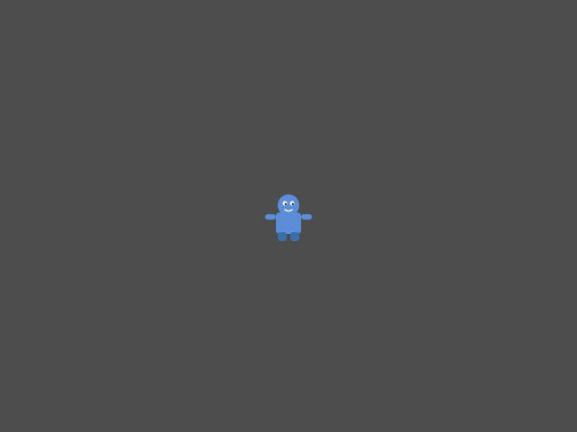](../arrow-sprite) **[arrow-sprite](../arrow-sprite)** Basic 2D movement with arrow keys, normalized direction, frame-rate-independent motion. | [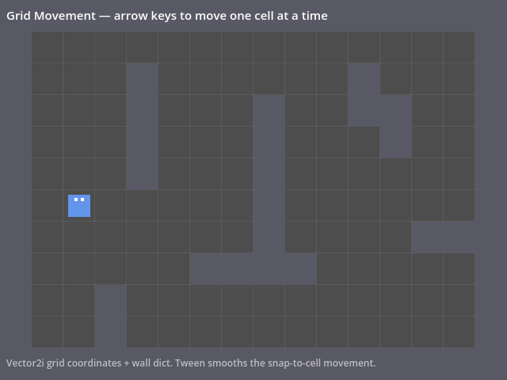](../grid-movement) **[grid-movement](../grid-movement)** Tile-based movement one cell at a time with tween animation and wall blocking. | [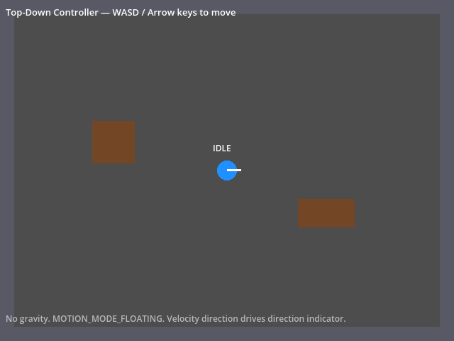](../top-down-controller) **[top-down-controller](../top-down-controller)** 8-directional free movement with a facing indicator — the canonical top-down setup. |
| [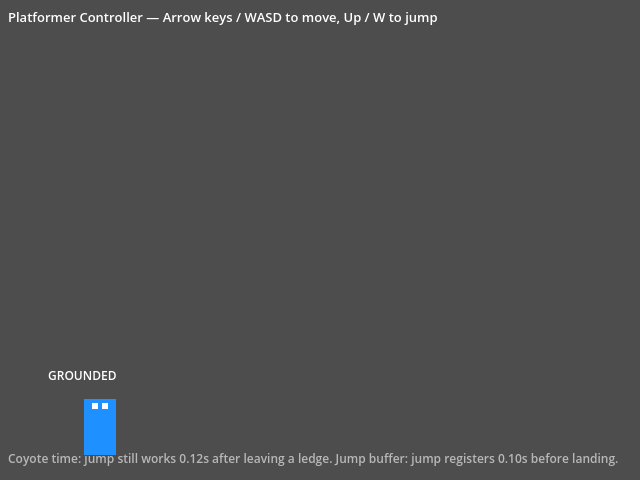](../platformer-controller) **[platformer-controller](../platformer-controller)** CharacterBody2D controller with coyote time and jump buffering for tight feel. | [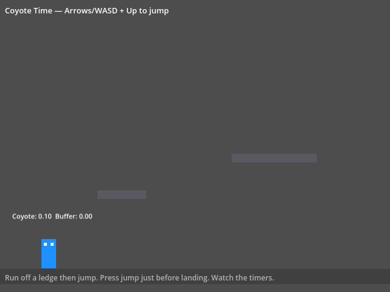](../coyote-time) **[coyote-time](../coyote-time)** Coyote time and jump buffering, the two classic platformer feel improvements. | [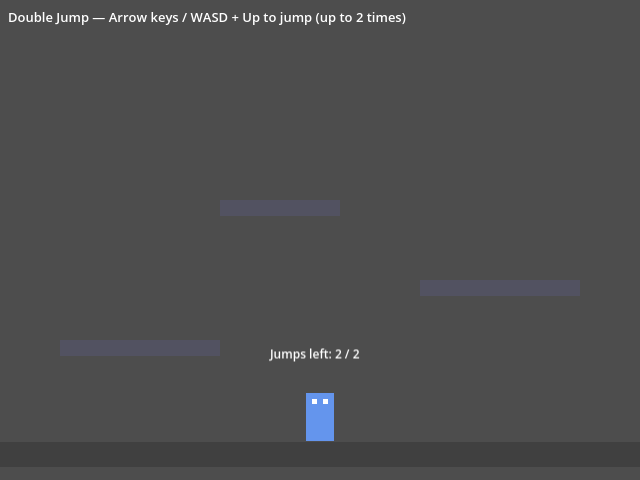](../double-jump) **[double-jump](../double-jump)** The double-jump mechanic. |
| [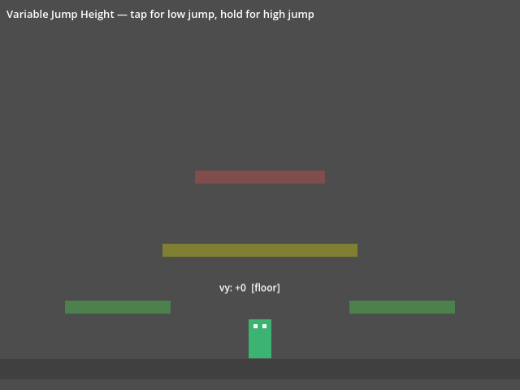](../variable-jump-height) **[variable-jump-height](../variable-jump-height)** Hold-to-jump-higher via a velocity cut on early button release. | [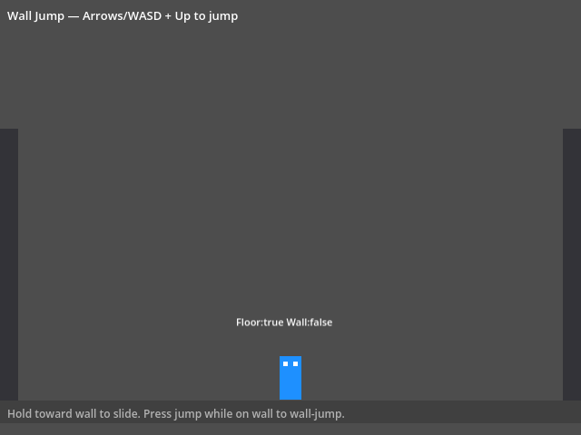](../wall-jump) **[wall-jump](../wall-jump)** Wall-sliding and wall-jumping mechanics. | [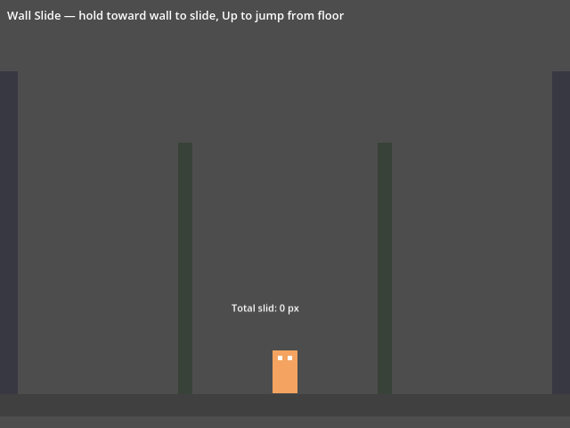](../wall-slide) **[wall-slide](../wall-slide)** Gravity reduction while pressing into a wall, terminal slide velocity, distance tracking. |
| [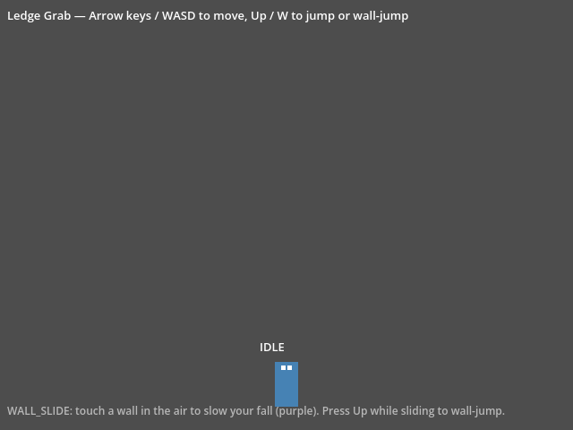](../ledge-grab) **[ledge-grab](../ledge-grab)** Cling to walls mid-air and launch off diagonally using `get_wall_normal()`. | [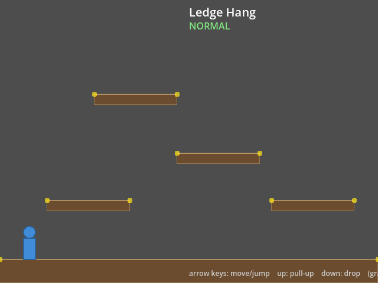](../ledge-hang) **[ledge-hang](../ledge-hang)** Auto-grab platform ledge corners when falling, hang, then pull up or drop. | [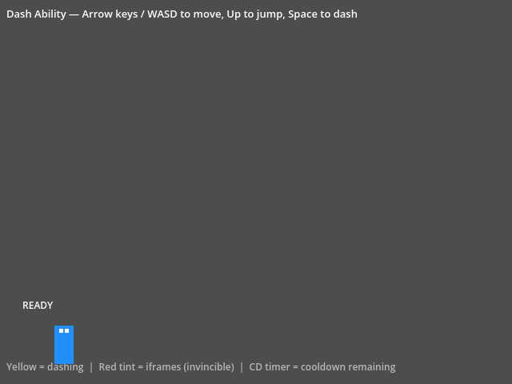](../dash-ability) **[dash-ability](../dash-ability)** Horizontal dash with cooldown, i-frames, and a ghost-image afterimage trail. |
| [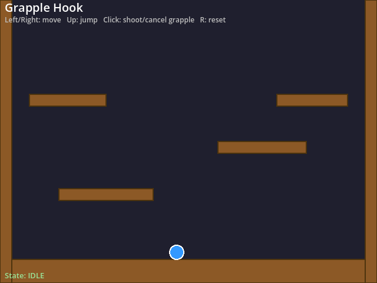](../grapple-hook) **[grapple-hook](../grapple-hook)** Fire a grapple and swing like a pendulum with a custom AABB-vs-circle collision system. | [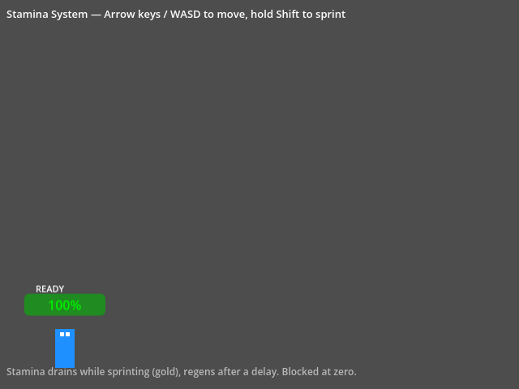](../stamina-system) **[stamina-system](../stamina-system)** A depletable/regenerating resource that gates sprinting. | [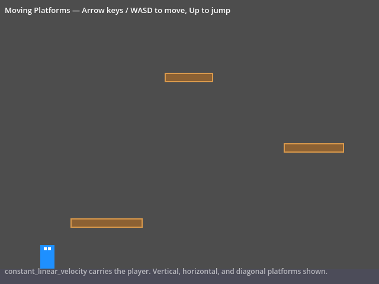](../moving-platforms) **[moving-platforms](../moving-platforms)** Oscillating platforms that correctly carry the player via `constant_linear_velocity`. |
| [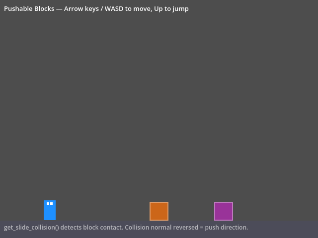](../pushable-blocks) **[pushable-blocks](../pushable-blocks)** Shove blocks by walking into them, reading impulses from `move_and_slide()` collisions. |  |  |

## 🎥 Cameras & Viewports

| | | |
|---|---|---|
| [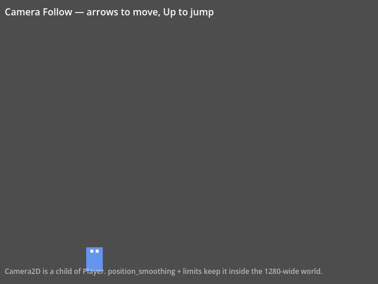](../camera-follow) **[camera-follow](../camera-follow)** Attach a `Camera2D` to the player with position smoothing and hard limits. | [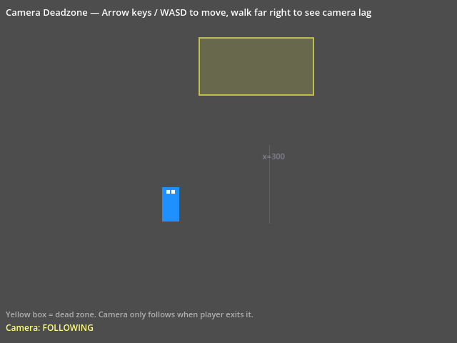](../camera-deadzone) **[camera-deadzone](../camera-deadzone)** Camera stays still until the player exits a rectangular dead zone, then catches up. | [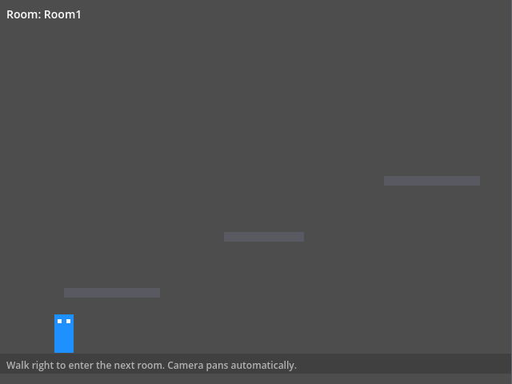](../camera-rooms) **[camera-rooms](../camera-rooms)** Room-based camera transitions using `Area2D`, signals, and `Tween`. |
| [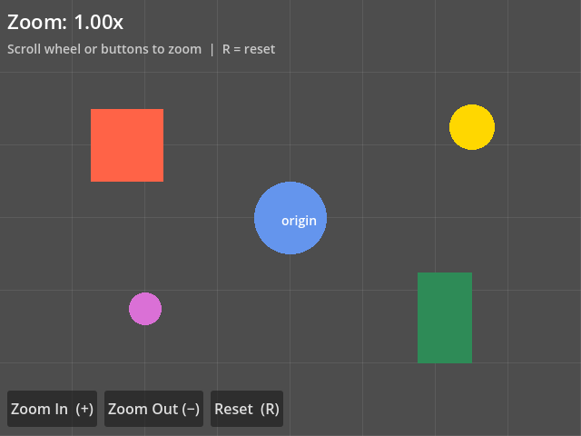](../camera-zoom) **[camera-zoom](../camera-zoom)** Smooth scroll-wheel `Camera2D` zoom with lerp targeting and min/max limits. | [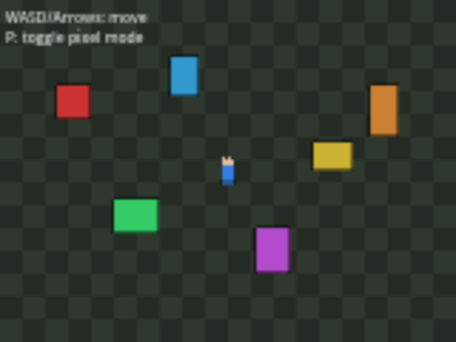](../pixel-art-camera) **[pixel-art-camera](../pixel-art-camera)** Render at 160×120 and integer-scale 4× via `SubViewport` for crisp pixel art. | [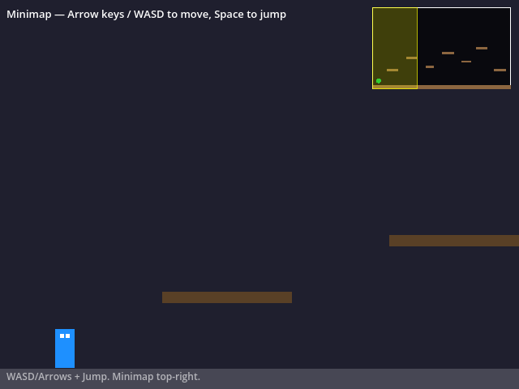](../minimap) **[minimap](../minimap)** A real-time minimap drawn in code for a wide side-scrolling world. |
| [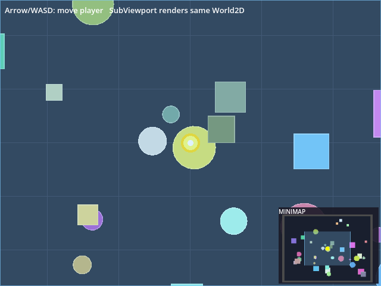](../subviewport) **[subviewport](../subviewport)** Render one `World2D` through two cameras (main + minimap) via `SubViewport`. | [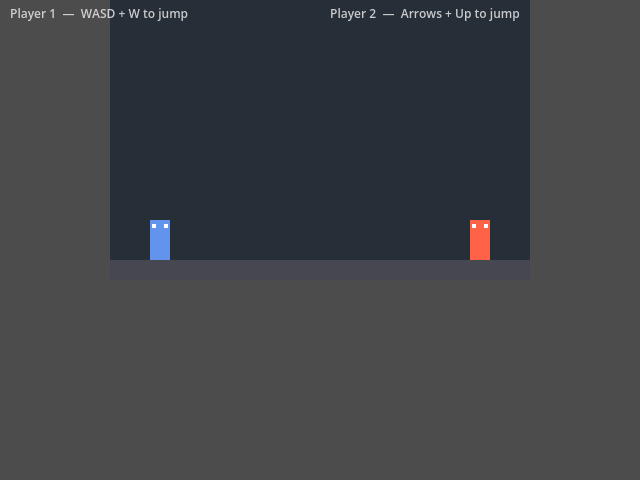](../split-screen) **[split-screen](../split-screen)** Two-player split-screen, each with independent world, physics, and camera. | [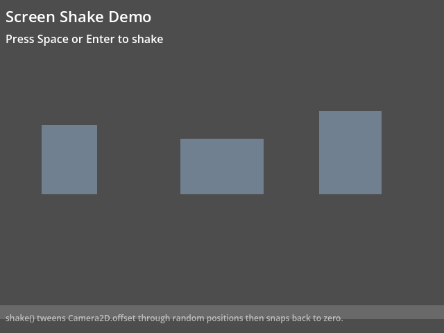](../screen-shake) **[screen-shake](../screen-shake)** Camera shake by tweening `Camera2D.offset` through random displacements. |

## ⚙️ Physics & Simulation

| | | |
|---|---|---|
| [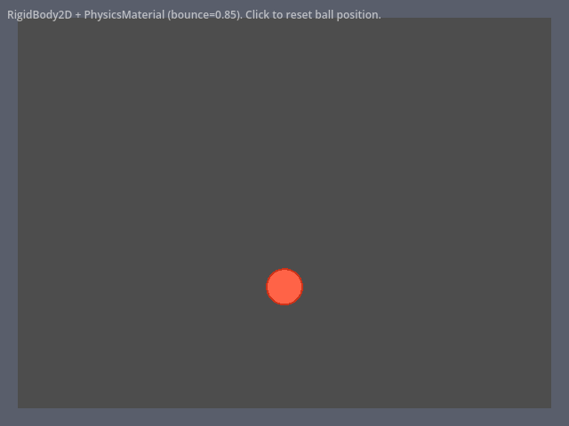](../bouncing-ball) **[bouncing-ball](../bouncing-ball)** A ball bouncing via Godot's built-in rigid body physics — no manual velocity code. | [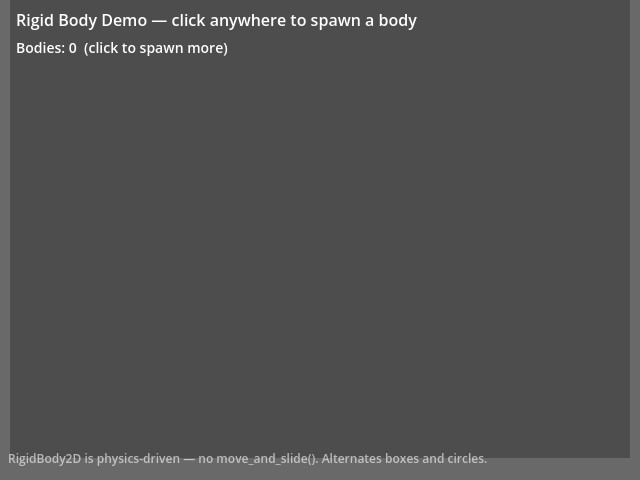](../rigid-body) **[rigid-body](../rigid-body)** `RigidBody2D` objects that fall, collide, and stack under gravity. | [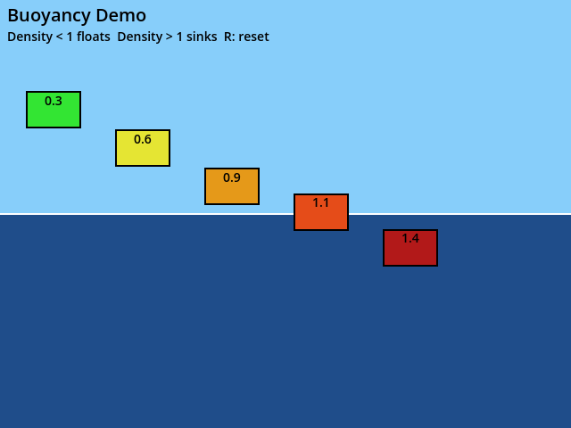](../buoyancy) **[buoyancy](../buoyancy)** Custom 2D buoyancy of boxes floating/sinking by density, no physics engine. |
| [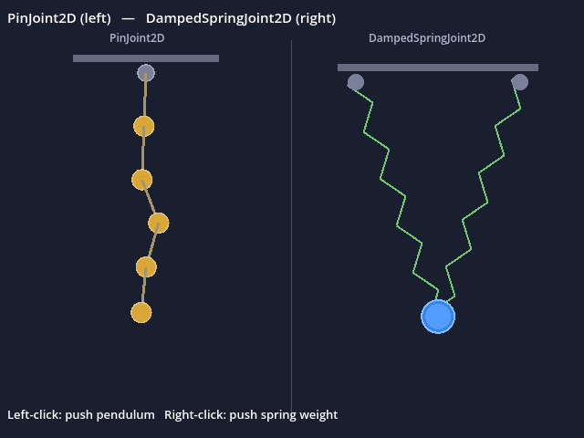](../joint-physics) **[joint-physics](../joint-physics)** A `PinJoint2D` pendulum chain and a `DampedSpringJoint2D` weight, built in code. | [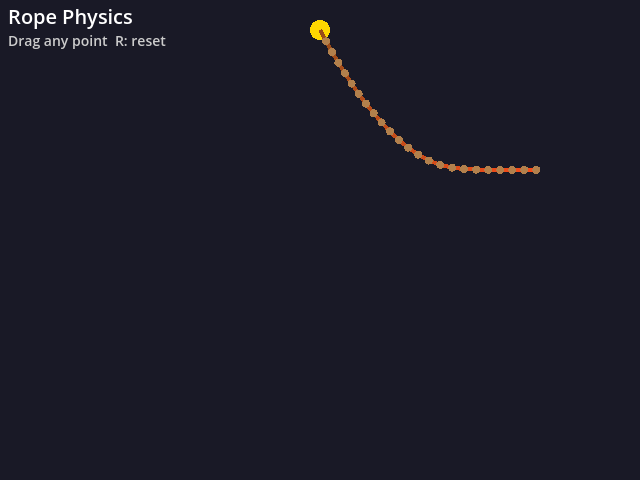](../rope-physics) **[rope-physics](../rope-physics)** A 24-node Verlet rope with iterative distance-constraint relaxation. | [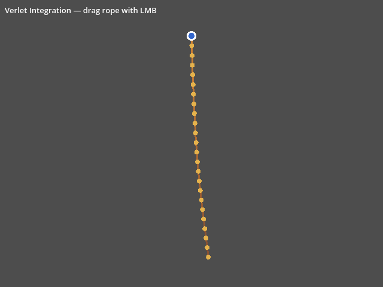](../verlet-integration) **[verlet-integration](../verlet-integration)** Position-based Verlet rope physics with mouse drag interaction. |
| [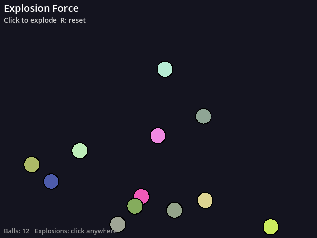](../explosion-force) **[explosion-force](../explosion-force)** Detonations that fling nearby balls outward with distance-based falloff. | [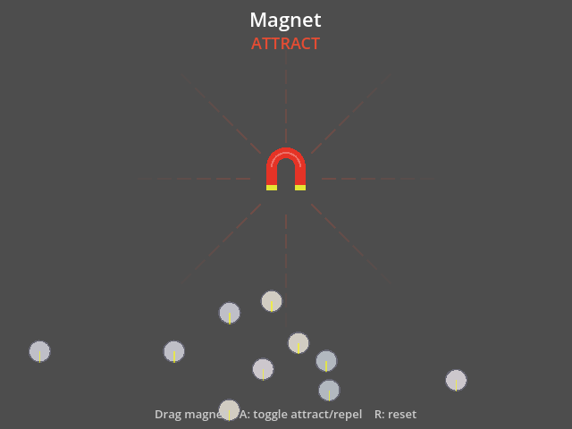](../magnet) **[magnet](../magnet)** Inverse-square attraction/repulsion field from a draggable magnet. | [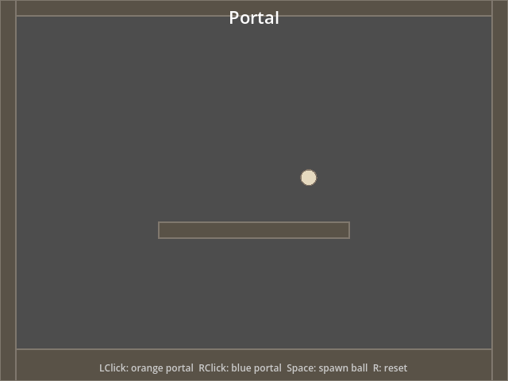](../portal) **[portal](../portal)** Balls enter one portal and exit the other with velocity correctly transformed. |
| [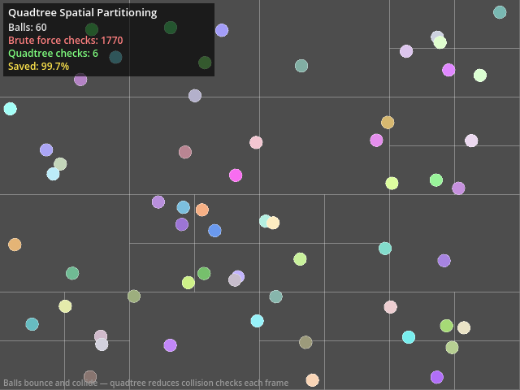](../quadtree) **[quadtree](../quadtree)** Quadtree spatial partitioning to cut collision checks from brute force. | [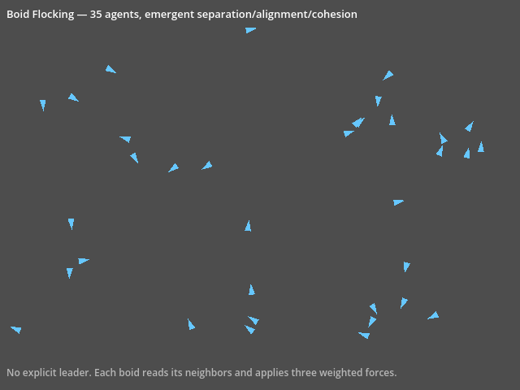](../boid-flocking) **[boid-flocking](../boid-flocking)** 35 agents flock via separation, alignment, and cohesion — emergent behavior. | [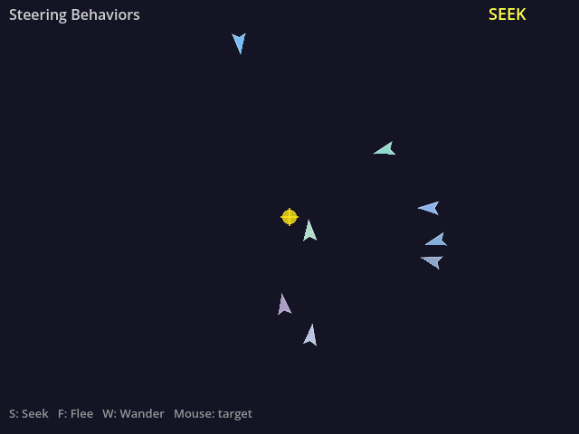](../steering-behaviors) **[steering-behaviors](../steering-behaviors)** Reynolds' Seek/Arrive, Flee, and Wander force-based steering. |
| [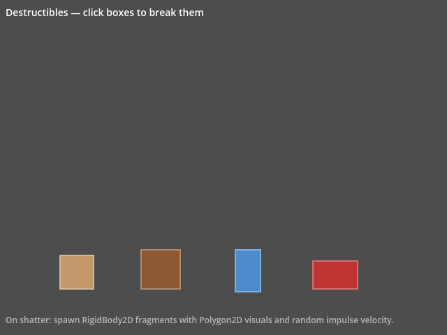](../destructibles) **[destructibles](../destructibles)** Click boxes to shatter them into scattered `RigidBody2D` fragments. |  |  |

## 🧠 AI, Pathfinding & Targeting

| | | |
|---|---|---|
| [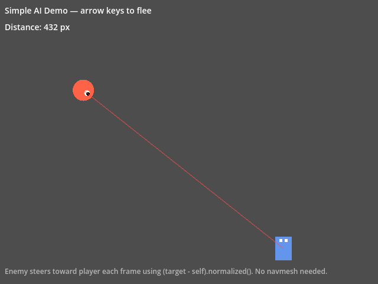](../simple-ai) **[simple-ai](../simple-ai)** An enemy that always moves directly toward the player. | [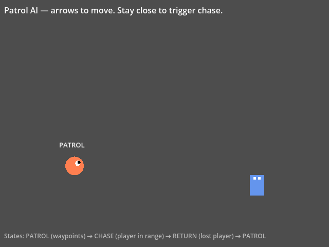](../patrol-ai) **[patrol-ai](../patrol-ai)** A three-state FSM: patrol waypoints, chase on detection, return when escaped. | [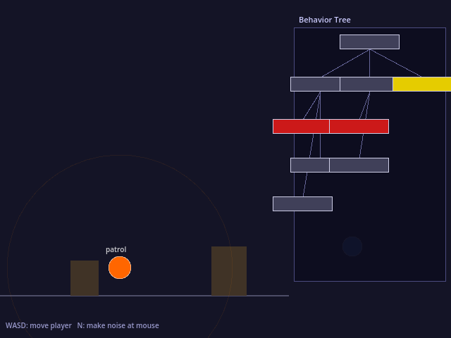](../behavior-tree) **[behavior-tree](../behavior-tree)** Enemy AI driven by a composable behavior tree (patrol/investigate/chase/attack). |
| [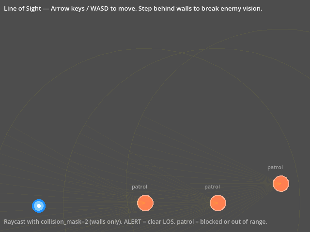](../line-of-sight) **[line-of-sight](../line-of-sight)** Enemies go ALERT on unobstructed physics-raycast line of sight to the player. | [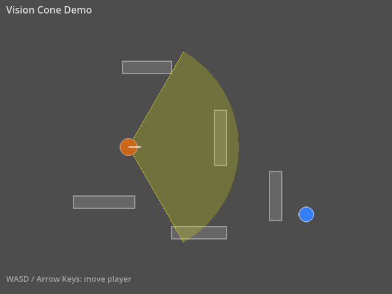](../vision-cone) **[vision-cone](../vision-cone)** A 120° FOV cone plus Liang-Barsky line-of-sight test against walls. | [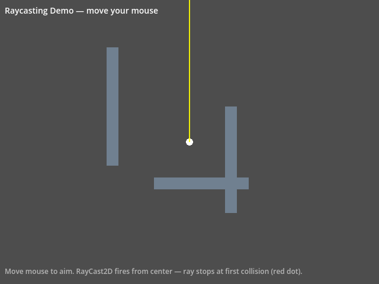](../raycasting) **[raycasting](../raycasting)** `RayCast2D` line-of-sight detection toward the mouse cursor. |
| [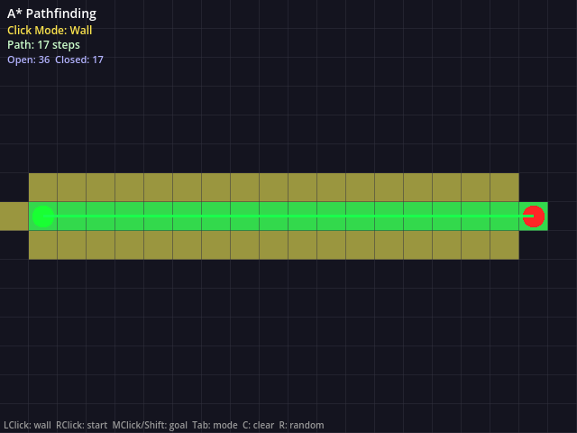](../pathfinding-astar) **[pathfinding-astar](../pathfinding-astar)** Interactive A* on a grid, visualizing open/closed sets and the optimal path. | [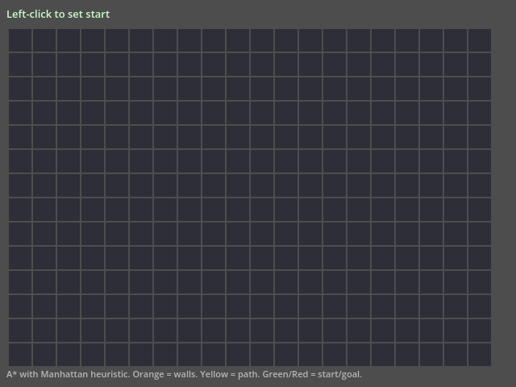](../grid-pathfinding) **[grid-pathfinding](../grid-pathfinding)** A* on a tile grid written from scratch, without `NavigationAgent2D`. | [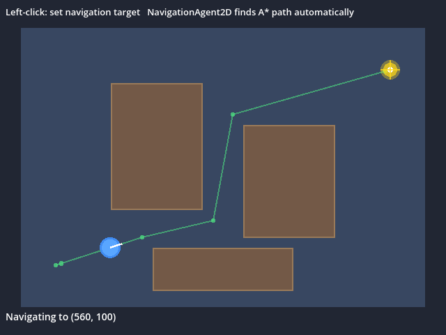](../navigation-agent) **[navigation-agent](../navigation-agent)** `NavigationAgent2D` with a code-built `NavigationPolygon` and obstacle avoidance. |
| [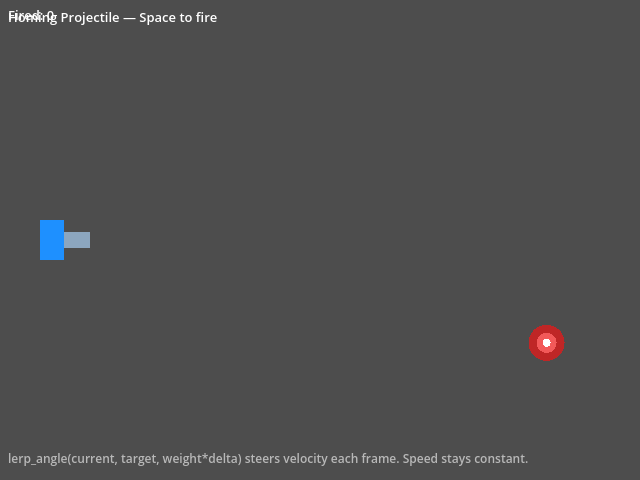](../homing-projectile) **[homing-projectile](../homing-projectile)** A missile that steers toward a moving target with `lerp_angle`. | [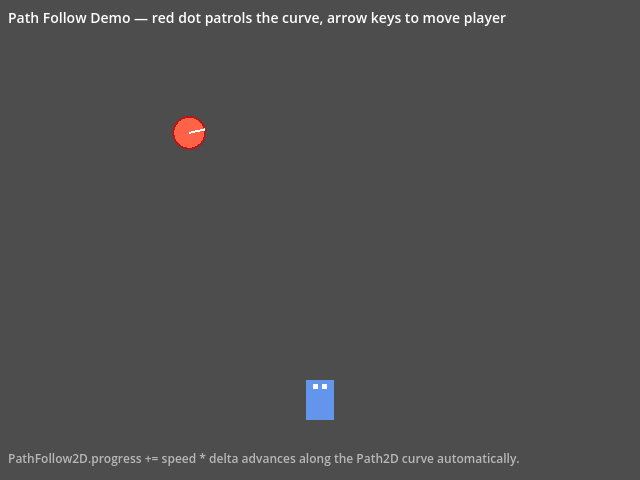](../path-follow) **[path-follow](../path-follow)** `PathFollow2D` constant-speed movement along a `Path2D` curve. | [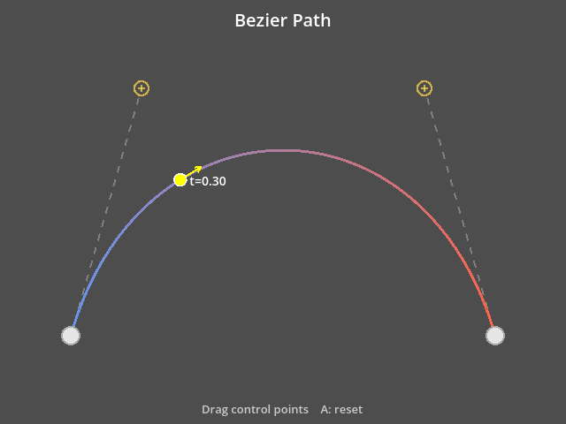](../bezier-path) **[bezier-path](../bezier-path)** Interactive cubic Bézier editor with an animated dot and tangent arrow. |

## ⚔️ Combat & Abilities

| | | |
|---|---|---|
| [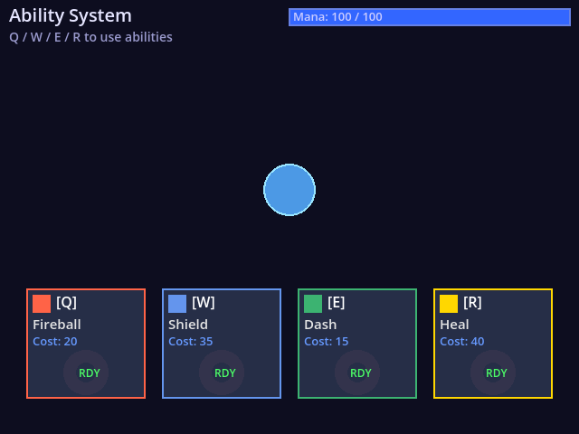](../ability-system) **[ability-system](../ability-system)** Four hotkey abilities with independent cooldowns and a shared mana pool. | [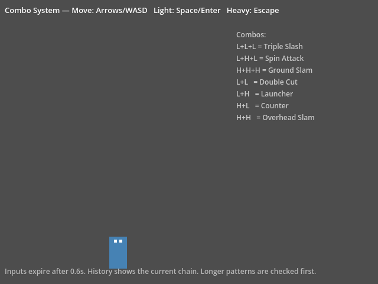](../combo-system) **[combo-system](../combo-system)** Timed attack chains where inputs expire and longer patterns take priority. | [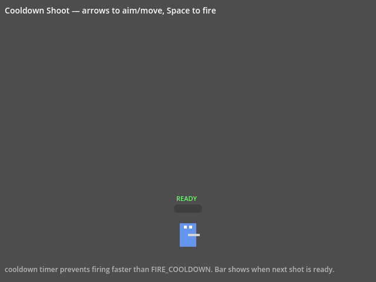](../cooldown-shoot) **[cooldown-shoot](../cooldown-shoot)** Projectile instantiation with a cooldown timer and `ProgressBar` indicator. |
| [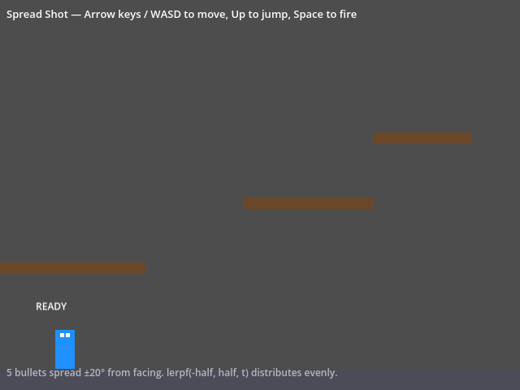](../spread-shot) **[spread-shot](../spread-shot)** Fire N bullets distributed evenly across a fixed angle. | [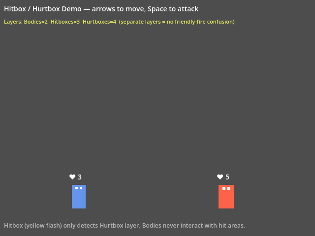](../hitbox-hurtbox) **[hitbox-hurtbox](../hitbox-hurtbox)** The hitbox/hurtbox pattern — attack area separate from vulnerable area. | [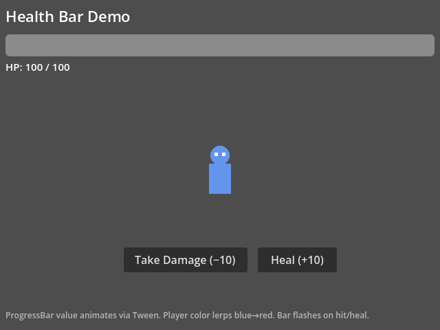](../health-bar) **[health-bar](../health-bar)** A complete HP system with animated bar, feedback flashes, and game-over. |
| [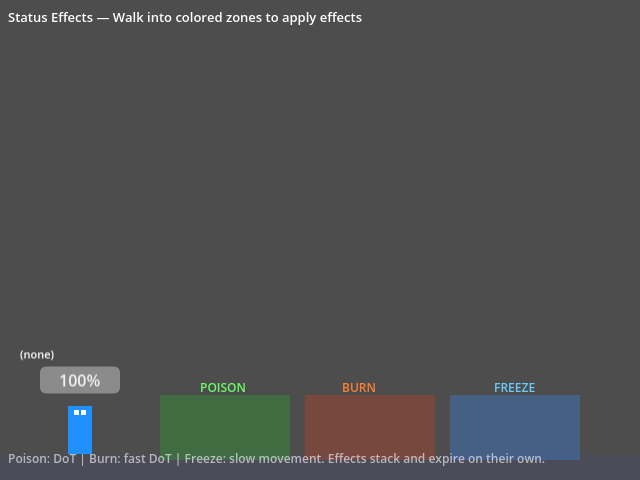](../status-effects) **[status-effects](../status-effects)** Poison/burn/freeze as timed, stackable, data-driven modifiers. | [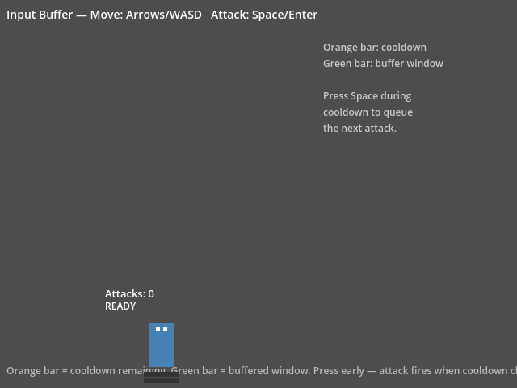](../input-buffer) **[input-buffer](../input-buffer)** Queue an early attack press during cooldown and fire it when it clears. | [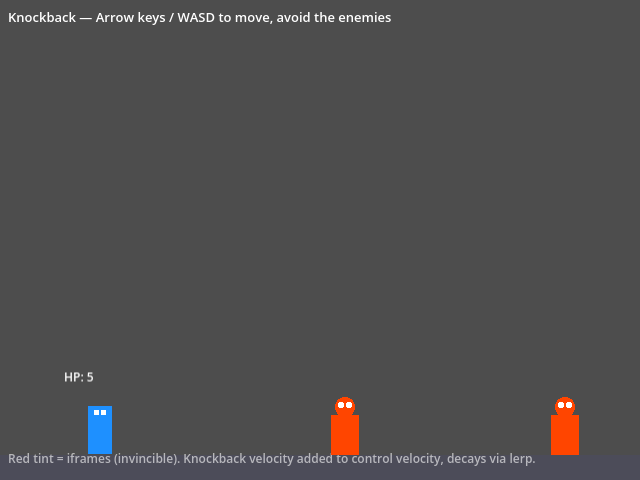](../knockback) **[knockback](../knockback)** Velocity-based hit recoil that decays exponentially, with i-frames. |

## 🏛️ Architecture & Patterns

| | | |
|---|---|---|
| [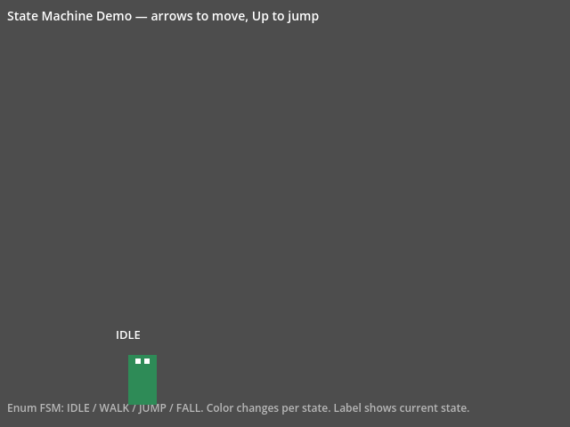](../state-machine) **[state-machine](../state-machine)** A four-state FSM (idle/walk/jump/fall) derived from physics state. | [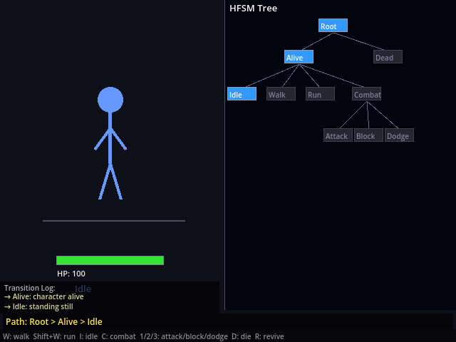](../state-machine-hfsm) **[state-machine-hfsm](../state-machine-hfsm)** A hierarchical FSM tree with enter/exit callbacks and cascading transitions. | [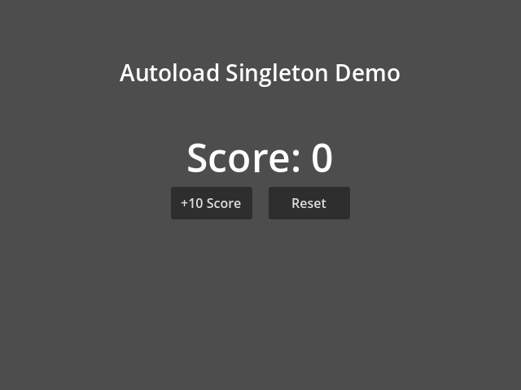](../autoload-score) **[autoload-score](../autoload-score)** The Autoload/Singleton pattern: global state that emits change signals. |
| [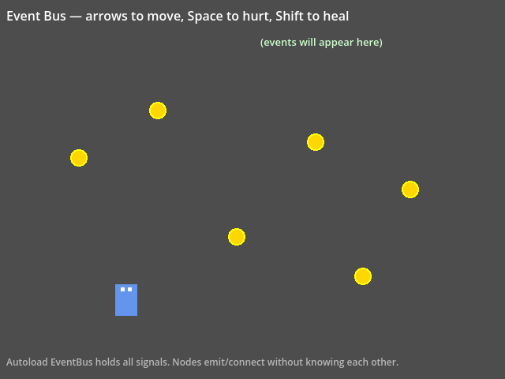](../event-bus) **[event-bus](../event-bus)** An Autoload event bus so nodes broadcast/listen without direct references. | [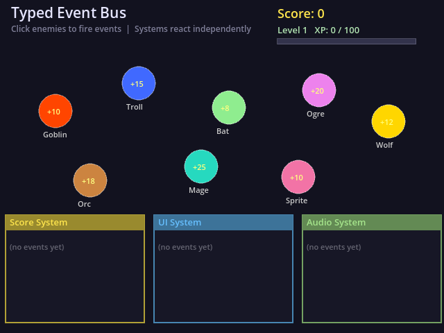](../typed-event-bus) **[typed-event-bus](../typed-event-bus)** A pub/sub bus with string-keyed events carrying typed `Dictionary` payloads. | [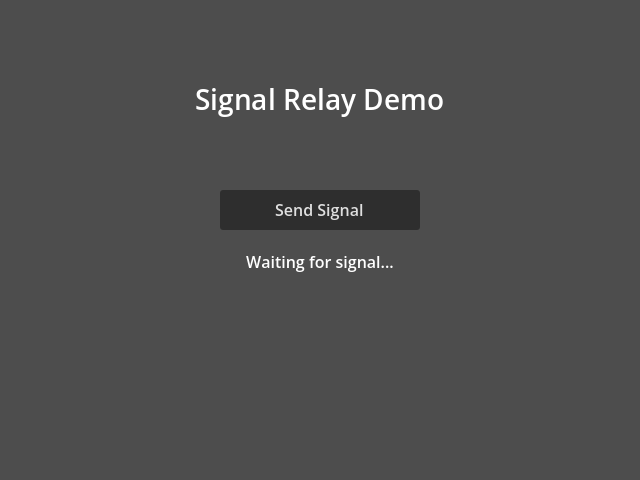](../signal-relay) **[signal-relay](../signal-relay)** The signal system: a transmitter emits, a receiver handles, main wires them. |
| [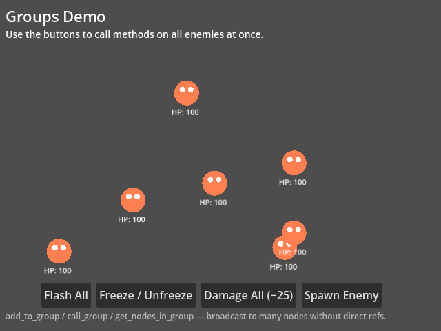](../groups) **[groups](../groups)** Broadcast a method call to every node in a named group in one line. | [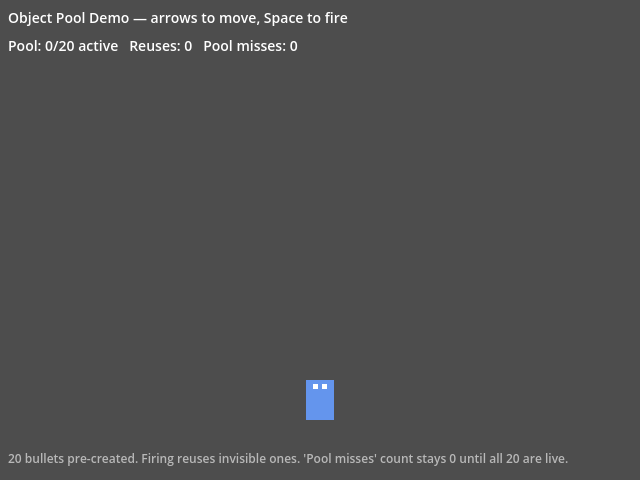](../object-pool) **[object-pool](../object-pool)** Pre-allocate and recycle objects instead of creating/destroying them. | [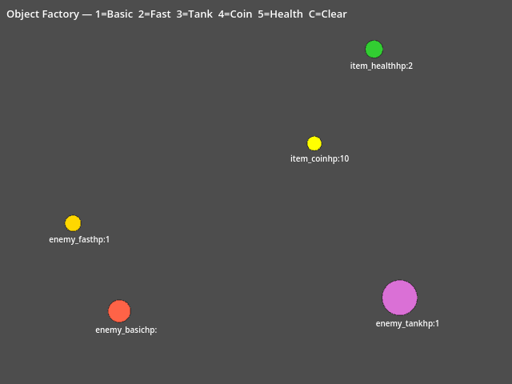](../object-factory) **[object-factory](../object-factory)** The factory pattern: a type registry decoupling creation from callers. |
| [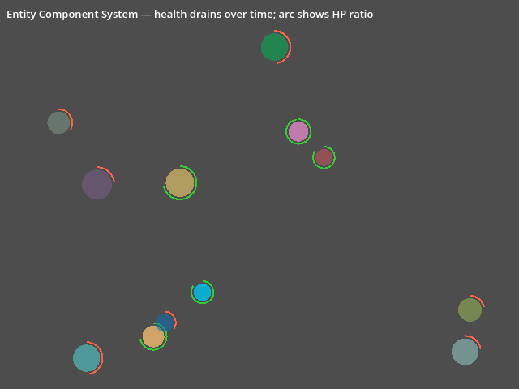](../entity-component-system) **[entity-component-system](../entity-component-system)** A pure-GDScript ECS: entity IDs, component dicts, system functions. | [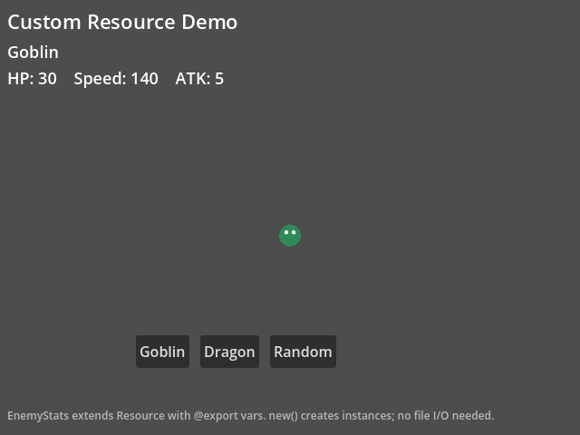](../custom-resource) **[custom-resource](../custom-resource)** `class_name` resources with `@export` vars as typed data containers. | [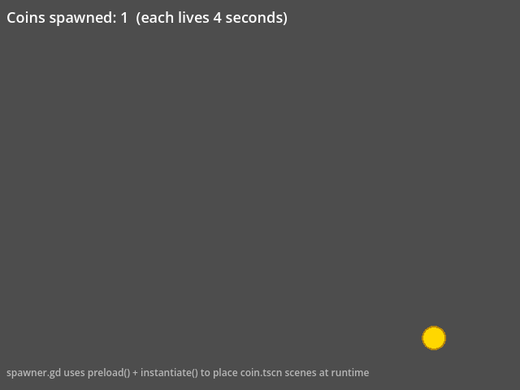](../scene-instancing) **[scene-instancing](../scene-instancing)** Instantiate scenes at runtime with `preload()` and a self-destruct `Timer`. |
| [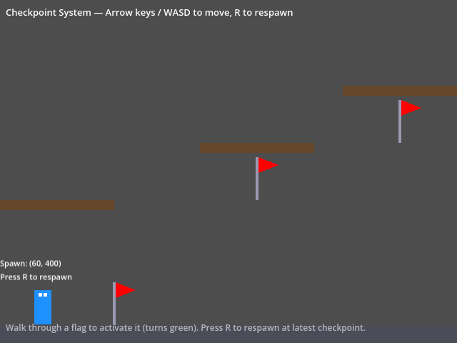](../checkpoint-system) **[checkpoint-system](../checkpoint-system)** One-way checkpoints that update respawn position; press R to die and respawn. | [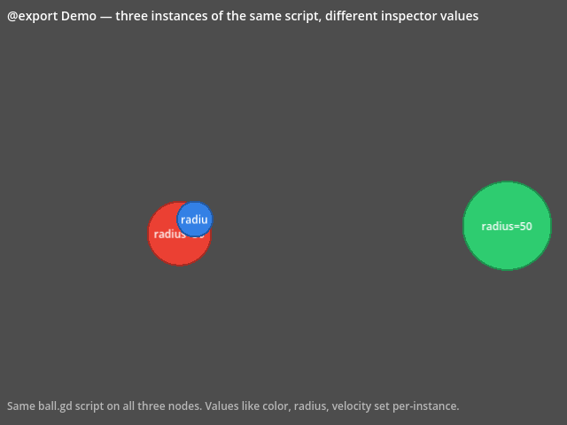](../export-vars) **[export-vars](../export-vars)** `@export` variables exposed to the Inspector without touching code. | [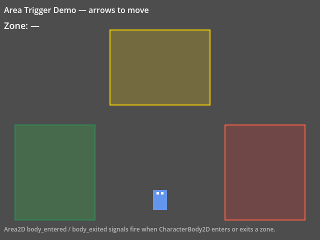](../area-trigger) **[area-trigger](../area-trigger)** `Area2D` invisible trigger zones firing signals on body enter/exit. |

## 💾 Data & Persistence

| | | |
|---|---|---|
| [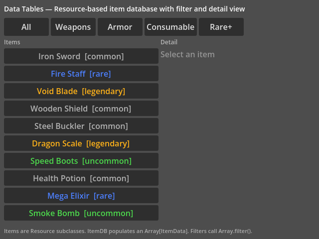](../data-tables) **[data-tables](../data-tables)** A Resource-based item database with a filter-and-detail UI. | [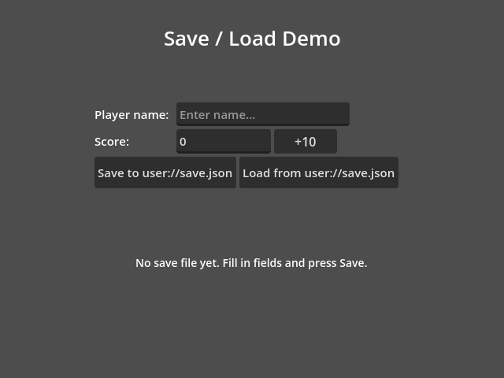](../save-load) **[save-load](../save-load)** Persist structured game state to JSON in the user data dir, across sessions. | [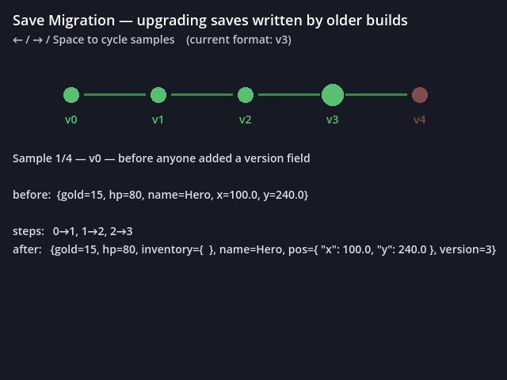](../save-migration) **[save-migration](../save-migration)** Upgrading saves written by older versions of your game, one step per version bump. |
| [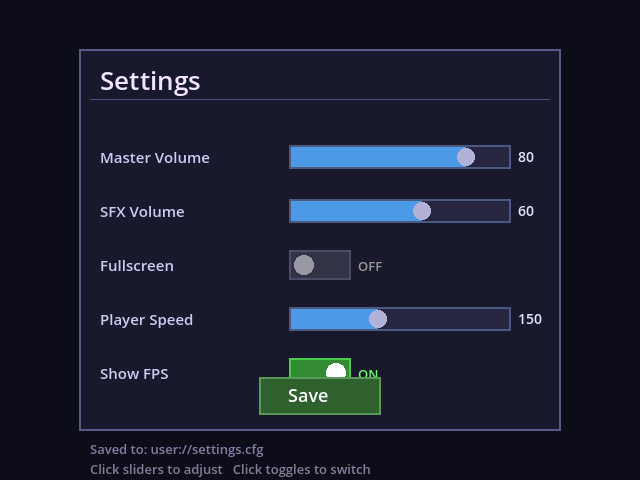](../config-file) **[config-file](../config-file)** A settings panel persisted to `user://settings.cfg` via `ConfigFile`. | [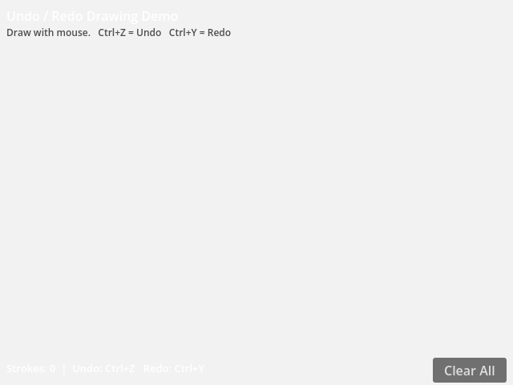](../undo-redo) **[undo-redo](../undo-redo)** A drawing canvas using Godot 4's built-in `UndoRedo` (Ctrl+Z / Ctrl+Y). | [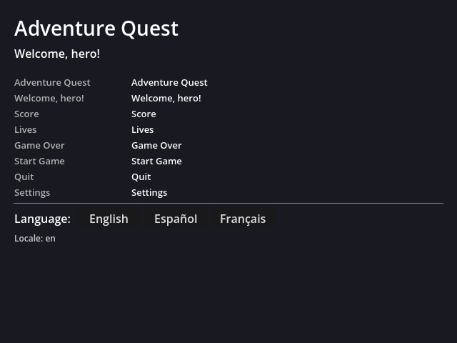](../localization) **[localization](../localization)** `TranslationServer` string tables switched at runtime across EN/ES/FR. |

## 🎯 Game Systems

| | | |
|---|---|---|
| [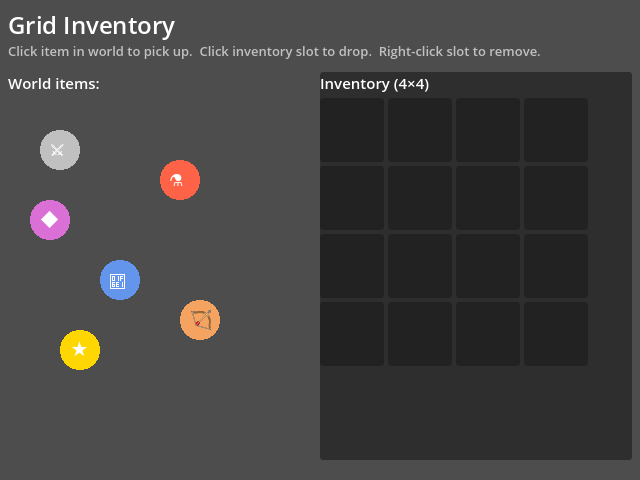](../inventory) **[inventory](../inventory)** A grid inventory: pick up, place, swap slots, and drop back to the world. | [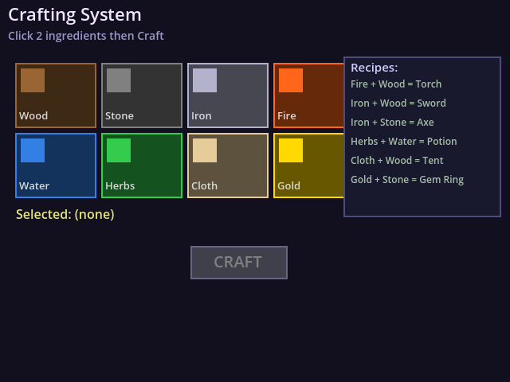](../crafting-system) **[crafting-system](../crafting-system)** Combine two ingredients into a result via a commutative recipe dictionary. | [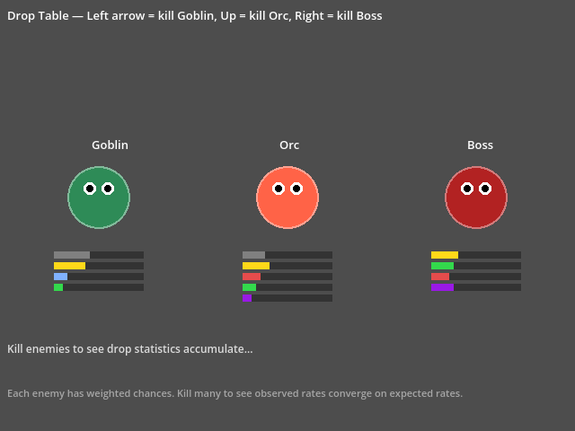](../drop-table) **[drop-table](../drop-table)** Weighted random loot; watch observed rates converge on expected probabilities. |
| [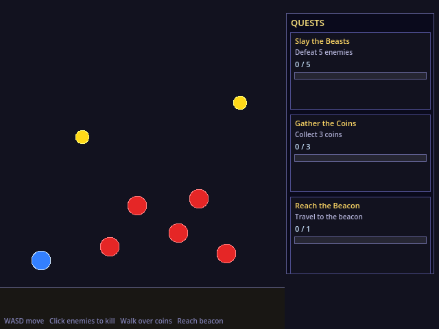](../quest-system) **[quest-system](../quest-system)** A multi-quest tracker with kill/collect/reach objectives and XP rewards. | [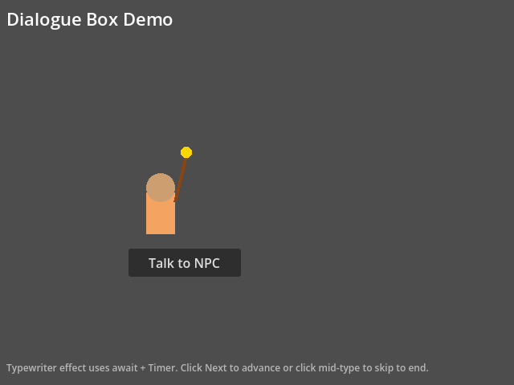](../dialogue-box) **[dialogue-box](../dialogue-box)** Typewriter text reveal, speaker labels, multi-line progression, skip. | [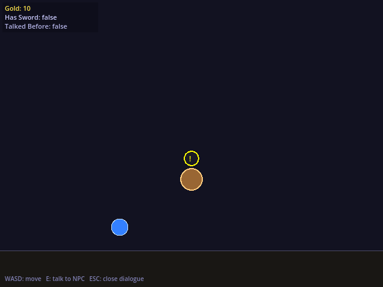](../dialogue-tree) **[dialogue-tree](../dialogue-tree)** Branching conversations with conditional choices that mutate game state. |
| [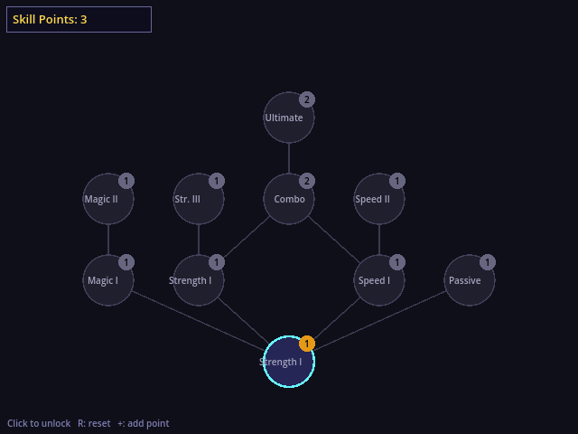](../skill-tree) **[skill-tree](../skill-tree)** A node-graph skill tree with prerequisites, costs, tooltips, and unlock states. | [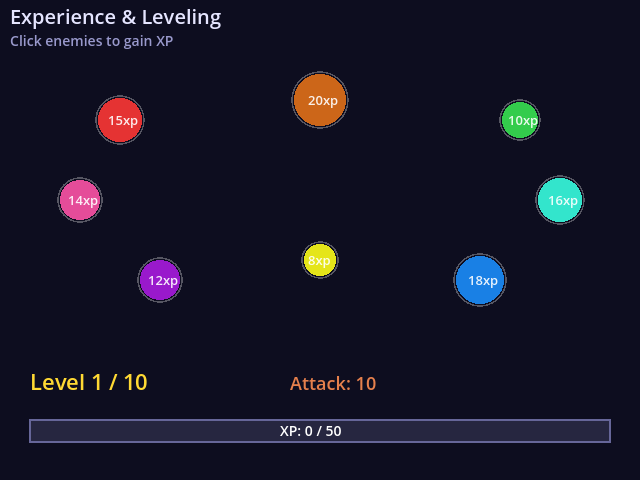](../experience-leveling) **[experience-leveling](../experience-leveling)** XP collection and leveling on an exponential curve with stat gains. | [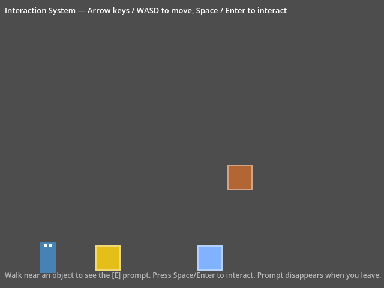](../interaction-system) **[interaction-system](../interaction-system)** A reusable "press E to interact" system using `Area2D` proximity. |
| [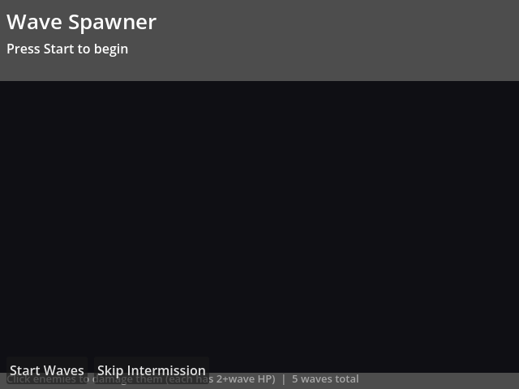](../wave-spawner) **[wave-spawner](../wave-spawner)** Phase-based waves with intermission countdowns and difficulty scaling. | [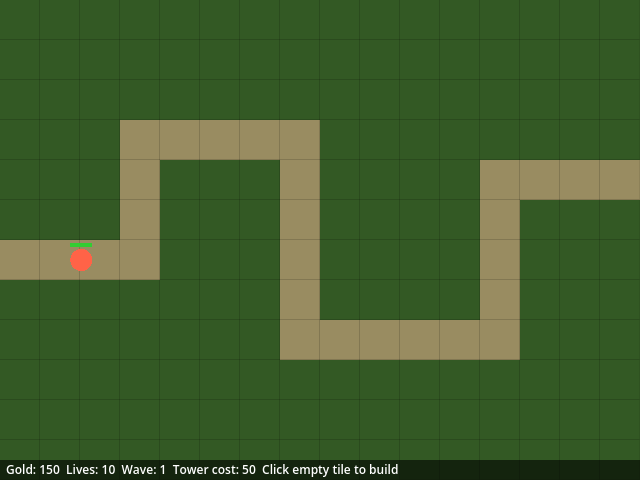](../tower-defense-base) **[tower-defense-base](../tower-defense-base)** The core TD loop: path enemies, tower placement, targeting, gold, waves. | [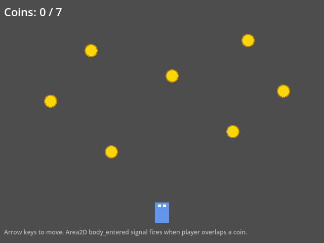](../coin-collector) **[coin-collector](../coin-collector)** Scene instancing, custom signals, and `Area2D` pickups for a collect-all goal. |

## 🖱️ UI & Menus

| | | |
|---|---|---|
| [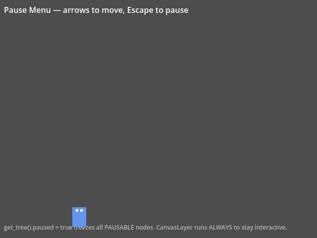](../pause-menu) **[pause-menu](../pause-menu)** `get_tree().paused` with a `PROCESS_MODE_ALWAYS` `CanvasLayer` menu. | [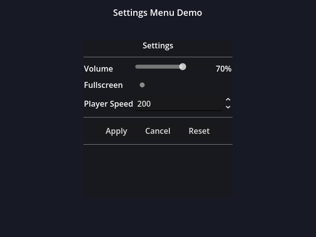](../settings-menu) **[settings-menu](../settings-menu)** A settings panel with volume slider, fullscreen toggle, and player color. | [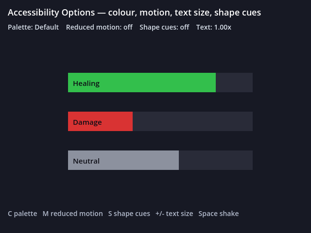](../accessibility-options) **[accessibility-options](../accessibility-options)** Colourblind-safe palettes, reduced motion, text scaling, and shape cues. |
| [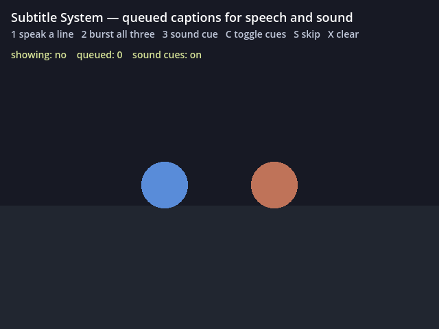](../subtitle-system) **[subtitle-system](../subtitle-system)** A caption queue for speech and non-speech audio, timed by reading speed. | [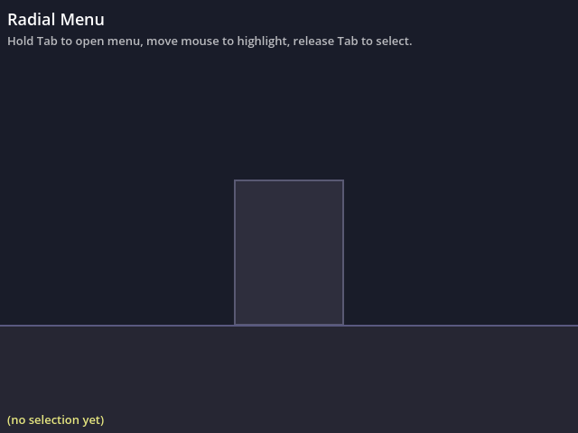](../radial-menu) **[radial-menu](../radial-menu)** Hold Tab to open a six-item radial action menu. | [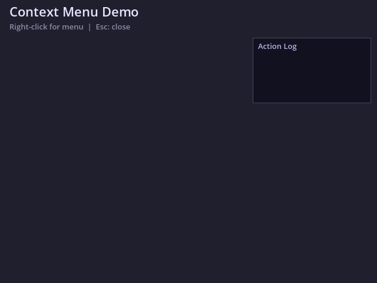](../context-menu) **[context-menu](../context-menu)** A right-click menu built entirely in `_draw()`/`_input()` — no Control nodes. |
| [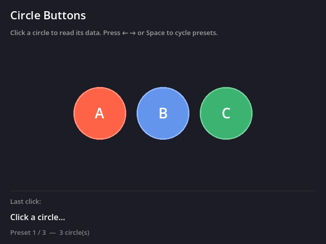](../circle-buttons) **[circle-buttons](../circle-buttons)** A reusable component rendering a data array as clickable circles. | [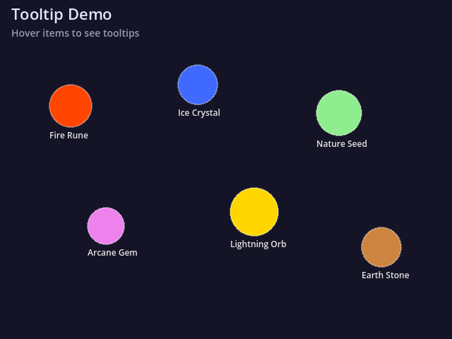](../tooltip) **[tooltip](../tooltip)** Hover tooltips with delay, alpha fade, accent colors, and edge clamping. | [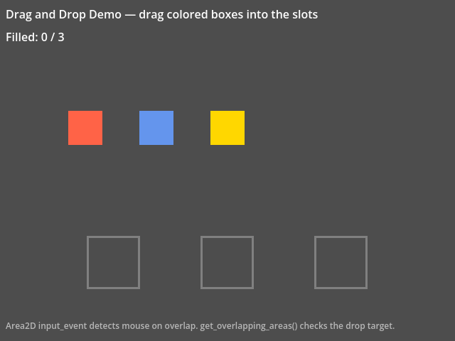](../drag-drop) **[drag-drop](../drag-drop)** Mouse drag-and-drop with snap-back when dropped outside a valid target. |
| [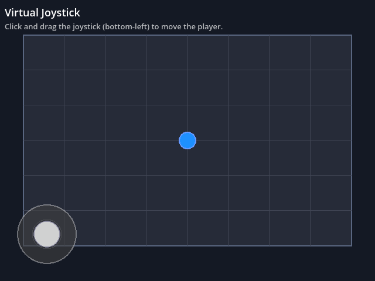](../virtual-joystick) **[virtual-joystick](../virtual-joystick)** An on-screen click-and-drag joystick for touch-style movement. | [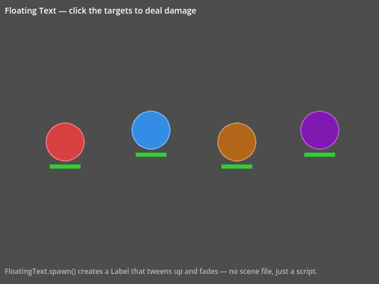](../floating-text) **[floating-text](../floating-text)** Self-managing damage/pickup labels that rise, fade, and free themselves. | [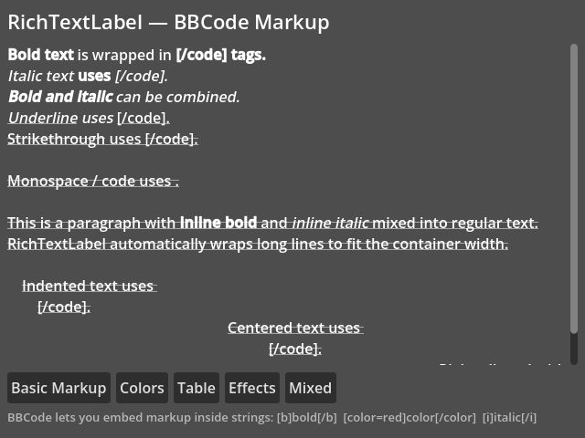](../multiline-text) **[multiline-text](../multiline-text)** `RichTextLabel` BBCode: bold, color, tables, animated effects. |
| [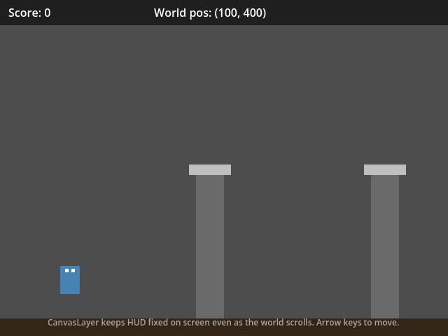](../canvas-layer) **[canvas-layer](../canvas-layer)** `CanvasLayer` screen-space overlays for HUDs and persistent UI. | [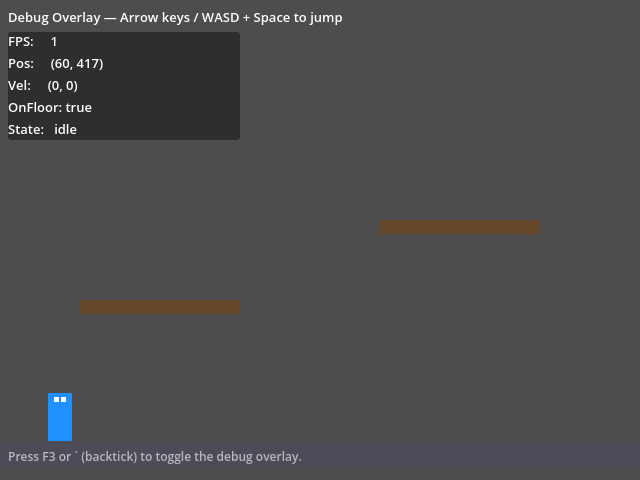](../debug-overlay) **[debug-overlay](../debug-overlay)** A toggleable always-on-top HUD showing FPS, position, velocity, state. | [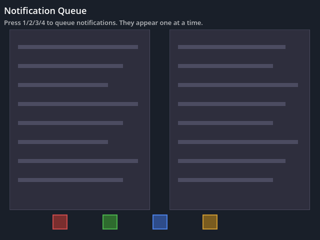](../notification-queue) **[notification-queue](../notification-queue)** A FIFO notification system sliding messages in one at a time. |

## 🎛️ Input

| | | |
|---|---|---|
| [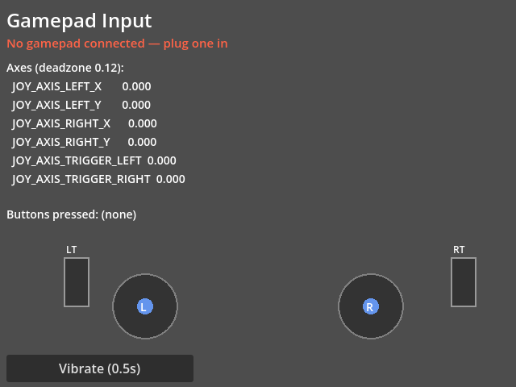](../gamepad-input) **[gamepad-input](../gamepad-input)** Joystick detection, analog axes with deadzone, buttons, and vibration. | [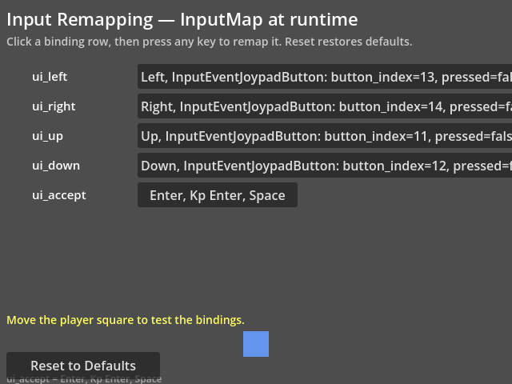](../input-remapping) **[input-remapping](../input-remapping)** Runtime key rebinding via the `InputMap` singleton. | [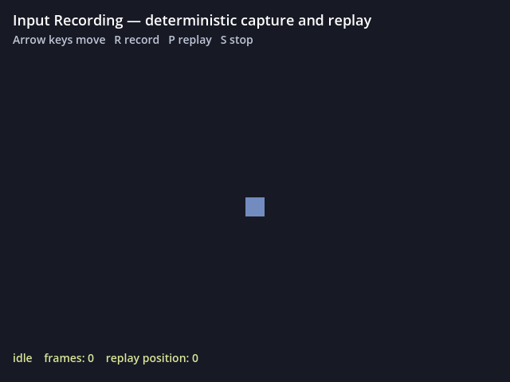](../input-recording) **[input-recording](../input-recording)** Capturing input per frame and replaying it deterministically. |
| [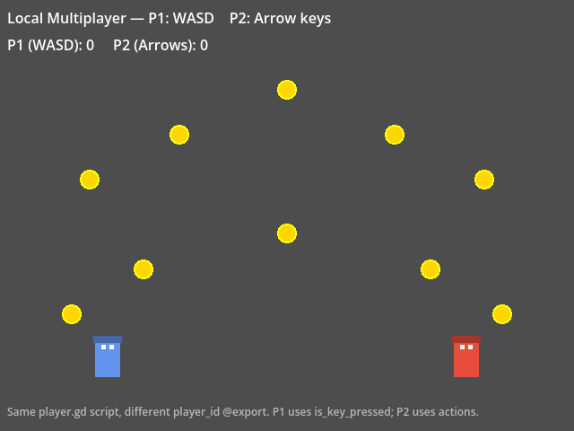](../local-multiplayer) **[local-multiplayer](../local-multiplayer)** Two players on one keyboard via per-instance input schemes. |  |  |

## 🔊 Audio

| | | |
|---|---|---|
| [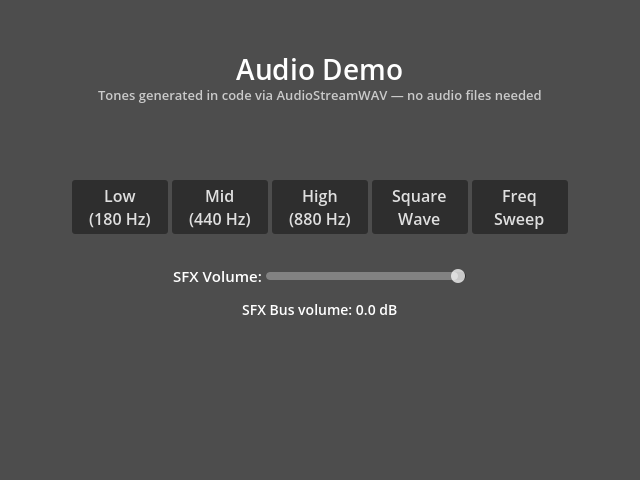](../audio-demo) **[audio-demo](../audio-demo)** Generate SFX in code via raw PCM synthesis, routed through audio buses. | [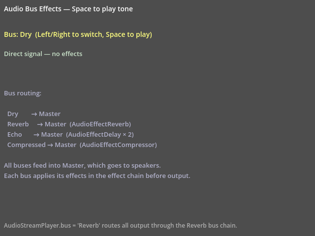](../audio-bus-effects) **[audio-bus-effects](../audio-bus-effects)** Dynamic reverb, echo, and compression routed through an `AudioBus`. | [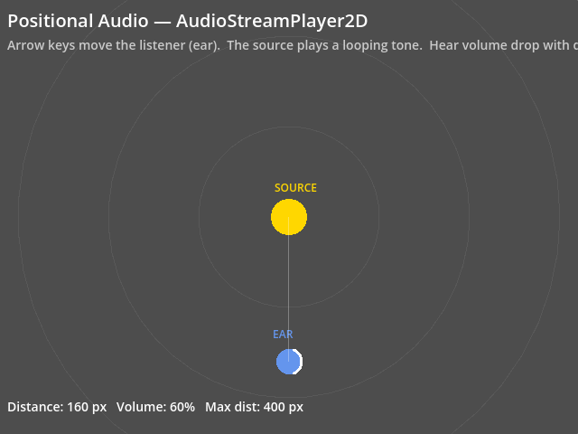](../audio-positional) **[audio-positional](../audio-positional)** `AudioStreamPlayer2D` spatial attenuation with a synthesized tone. |
| [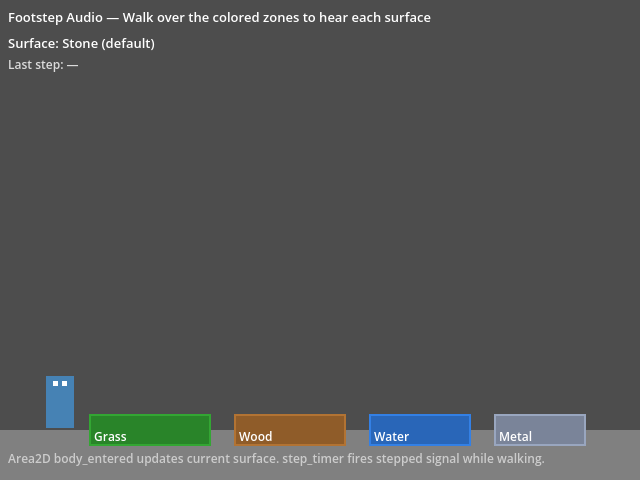](../footstep-audio) **[footstep-audio](../footstep-audio)** Surface-sensitive footsteps synthesized per surface on a step signal. | [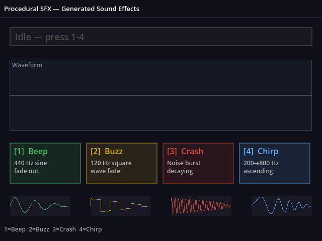](../procedural-sfx) **[procedural-sfx](../procedural-sfx)** Real-time SFX synthesis via `AudioStreamGeneratorPlayback.push_frame()`. | [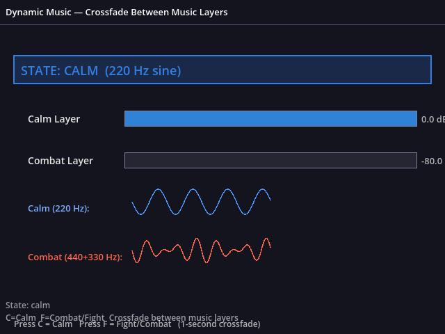](../dynamic-music) **[dynamic-music](../dynamic-music)** Real-time synthesis and crossfading between two music layers. |
| [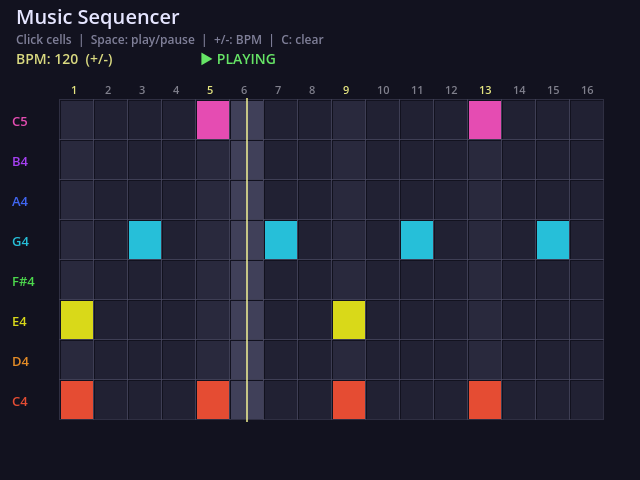](../music-sequencer) **[music-sequencer](../music-sequencer)** A 16-step × 8-note step sequencer with real-time sine synthesis. |  |  |

## ✨ Shaders & Visual Effects

| | | |
|---|---|---|
| [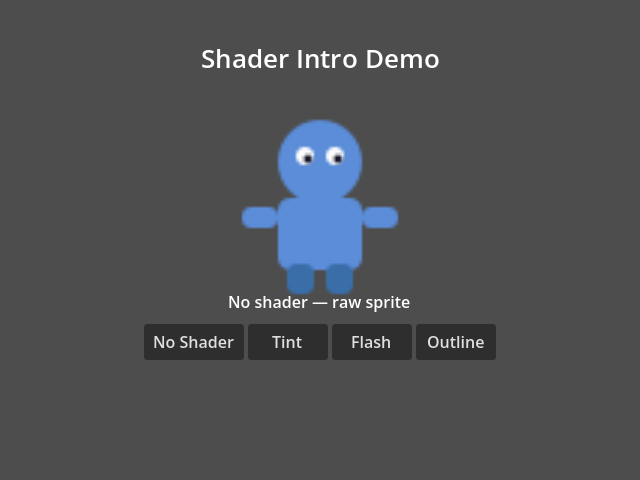](../shader-intro) **[shader-intro](../shader-intro)** Intro to `ShaderMaterial`: tint, hit-flash, and outline swapped at runtime. | [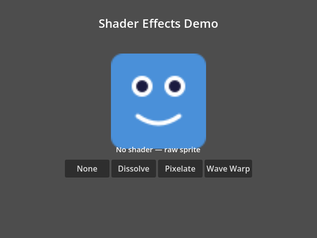](../shader-effects) **[shader-effects](../shader-effects)** Applied shaders: dissolve, pixelate, and wave-warp. | [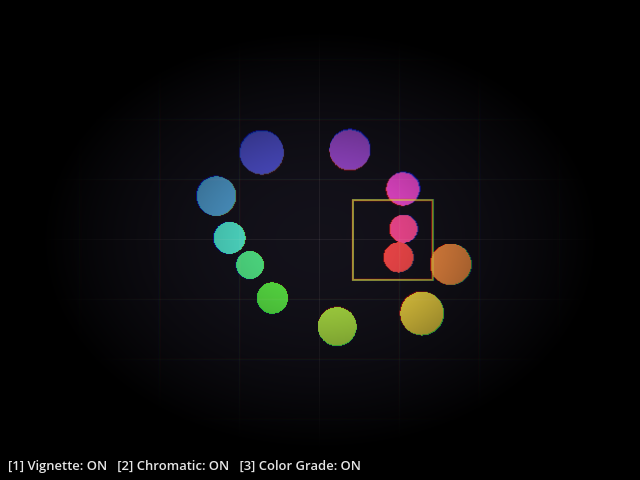](../post-processing-stack) **[post-processing-stack](../post-processing-stack)** A composable pipeline: vignette, chromatic aberration, color grading. |
| [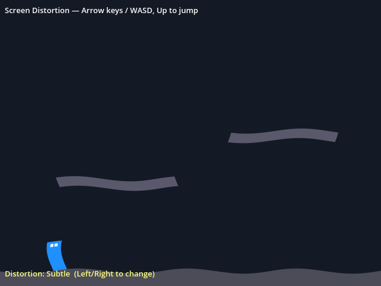](../screen-distortion) **[screen-distortion](../screen-distortion)** Full-screen heat-haze via `SubViewport` + UV-displacing shader. | [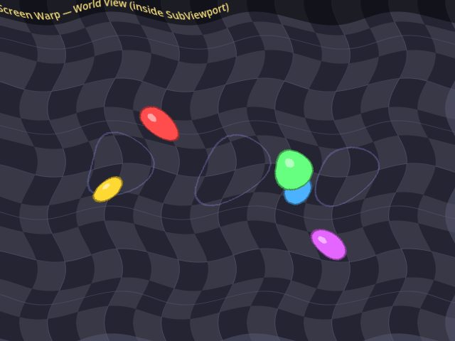](../screen-warp) **[screen-warp](../screen-warp)** Sinusoidal UV displacement of the whole world via `SubViewportContainer`. | [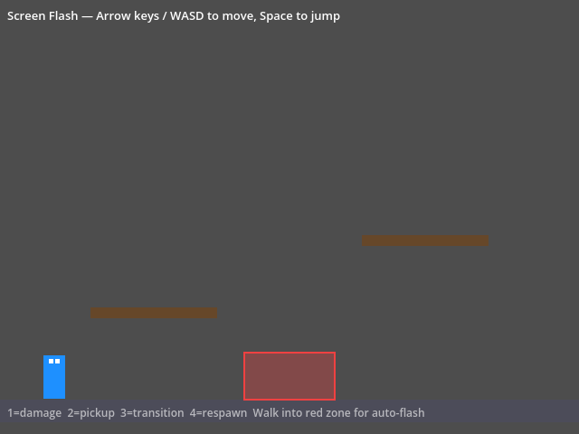](../screen-flash) **[screen-flash](../screen-flash)** Full-screen color flash feedback via a `ColorRect` + Tween. |
| [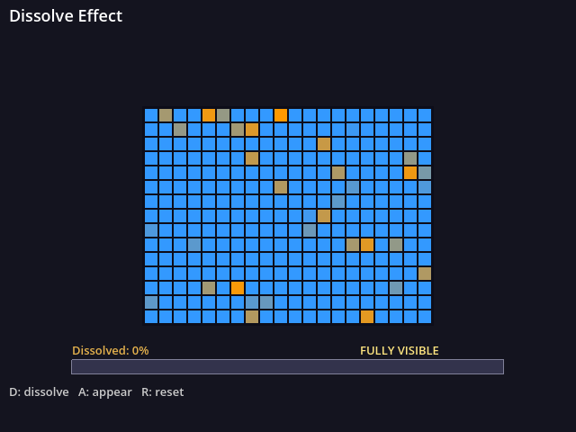](../dissolve-effect) **[dissolve-effect](../dissolve-effect)** Noise-threshold dissolve/appear transition on a grid — no shader. | [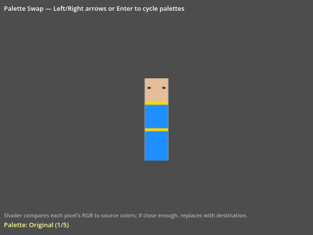](../palette-swap) **[palette-swap](../palette-swap)** A shader replacing source colors with destination colors by RGB distance. | [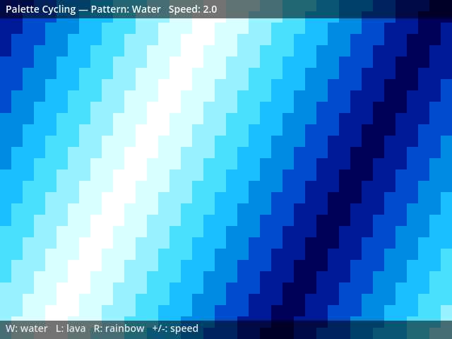](../palette-cycling) **[palette-cycling](../palette-cycling)** Classic indexed-color palette rotation for animated water/lava/rainbow. |
| [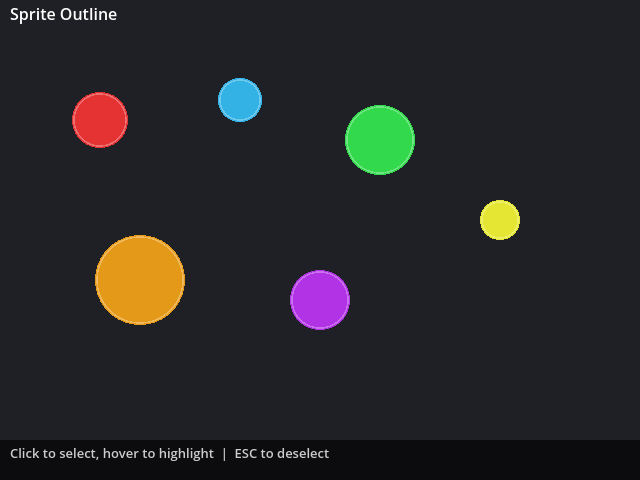](../sprite-outline) **[sprite-outline](../sprite-outline)** Hover/selection outlines via procedural `_draw()` — no sprites or shaders. | [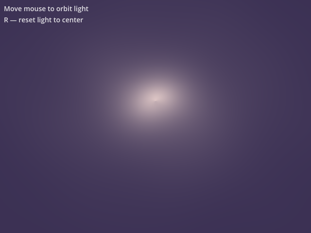](../normal-map-lighting) **[normal-map-lighting](../normal-map-lighting)** Procedural bump-map Phong lighting from a finite-difference height field. | [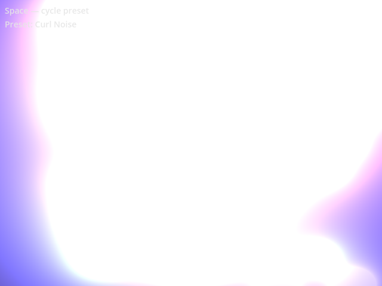](../gpu-particles-custom) **[gpu-particles-custom](../gpu-particles-custom)** 80 particles simulated analytically in a fragment shader — no CPU state. |
| [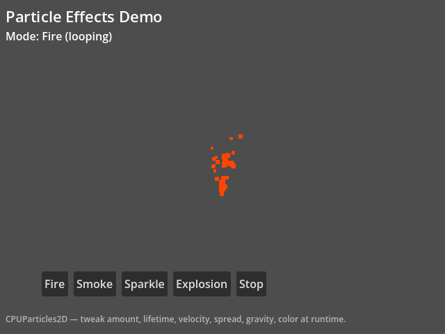](../particle-effects) **[particle-effects](../particle-effects)** `CPUParticles2D` fire, smoke, sparkle, and explosion on one emitter. | [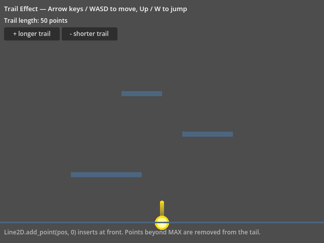](../trail-effect) **[trail-effect](../trail-effect)** A `Line2D` gradient trail following a moving object. | [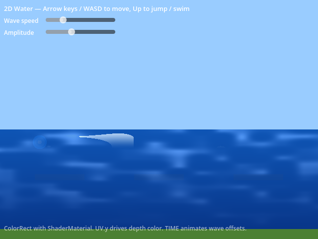](../2d-water) **[2d-water](../2d-water)** An animated water surface shader with distortion, foam, and shimmer. |
| [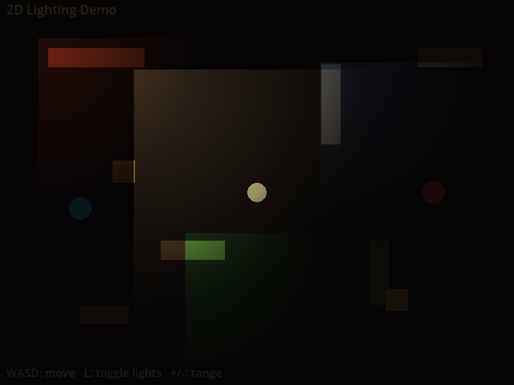](../2d-lighting) **[2d-lighting](../2d-lighting)** Runtime `GradientTexture2D` point lights under a global `CanvasModulate`. | [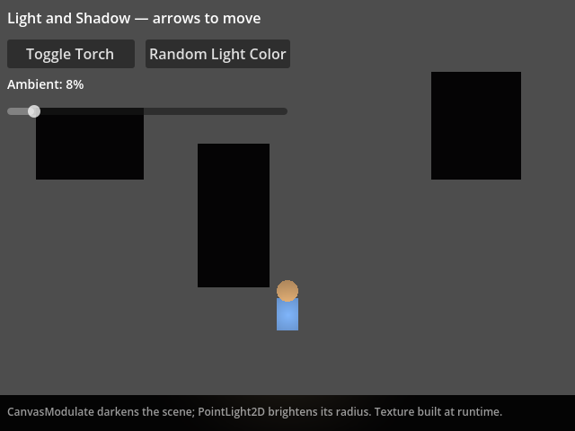](../light-shadow) **[light-shadow](../light-shadow)** `PointLight2D` with a procedural radial gradient and `CanvasModulate`. | [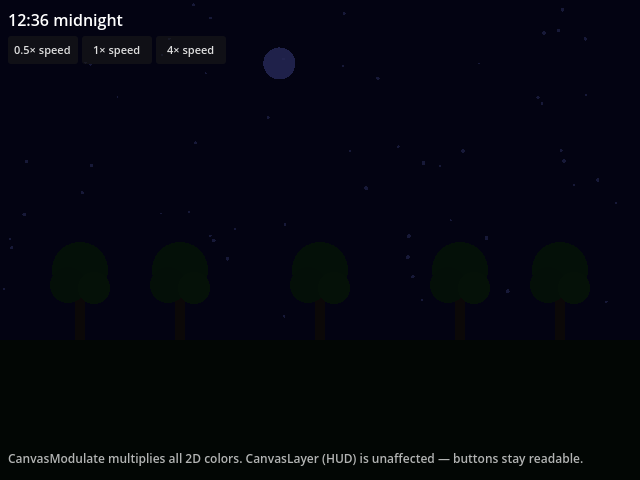](../day-night-cycle) **[day-night-cycle](../day-night-cycle)** A 24-hour cycle via `CanvasModulate` with sun/moon arcs and stars. |
| [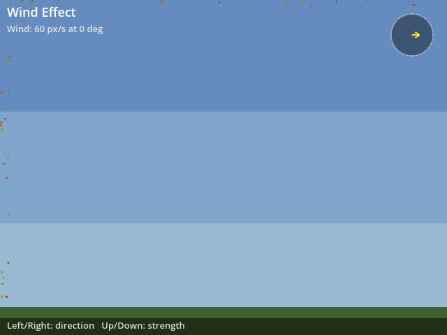](../wind-effect) **[wind-effect](../wind-effect)** 80 wind-blown leaves with gusts, damping, lifetime fade, and motion blur. |  |  |

## 🎞️ Animation

| | | |
|---|---|---|
| [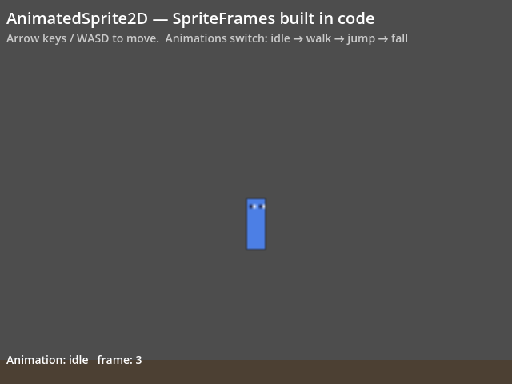](../animated-sprite) **[animated-sprite](../animated-sprite)** A sprite sheet generated entirely in code — no image files or imports. | [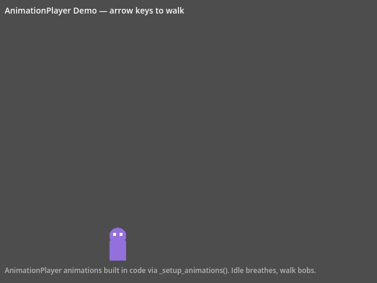](../animated-walk) **[animated-walk](../animated-walk)** Character animation in code via `AnimationPlayer` and `AnimationLibrary`. | [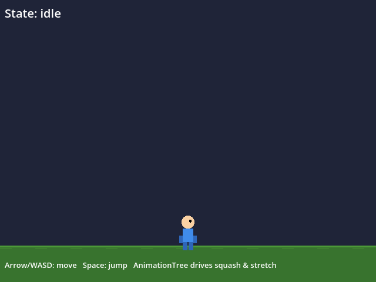](../animation-tree) **[animation-tree](../animation-tree)** `AnimationTree` + `AnimationNodeStateMachine` driving squash-and-stretch. |
| [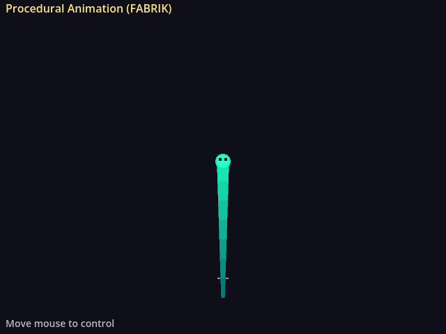](../procedural-animation) **[procedural-animation](../procedural-animation)** FABRIK inverse kinematics on an 8-joint chain following the mouse. | [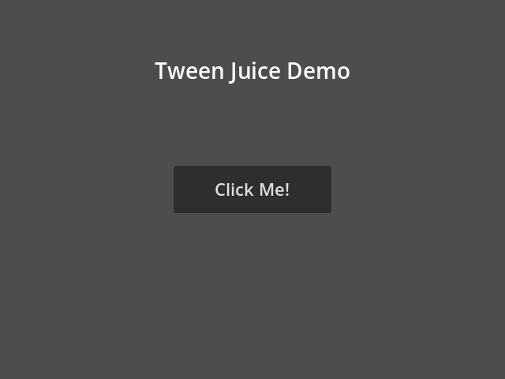](../tween-juice) **[tween-juice](../tween-juice)** "Game feel" via Tween: button squish and a floating score label. |  |

## 🌍 Procedural Generation

| | | |
|---|---|---|
| [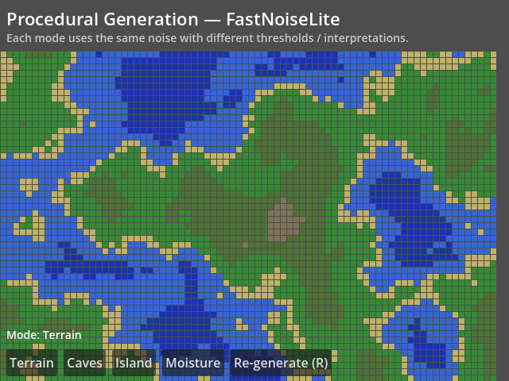](../procedural-gen) **[procedural-gen](../procedural-gen)** `FastNoiseLite` generating terrain, caves, islands, and moisture maps. | [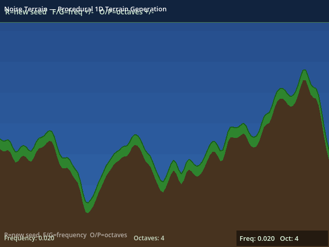](../noise-terrain) **[noise-terrain](../noise-terrain)** 1D terrain from `get_noise_1d()`, redrawing live as you tune parameters. | [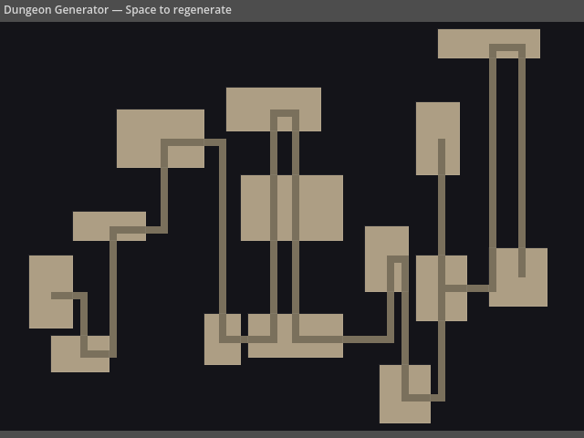](../dungeon-generator) **[dungeon-generator](../dungeon-generator)** Random room placement with L-shaped corridor carving. |
| [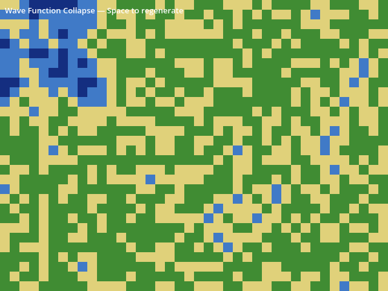](../wave-function-collapse) **[wave-function-collapse](../wave-function-collapse)** Constraint-propagation tile placement for locally consistent maps. | [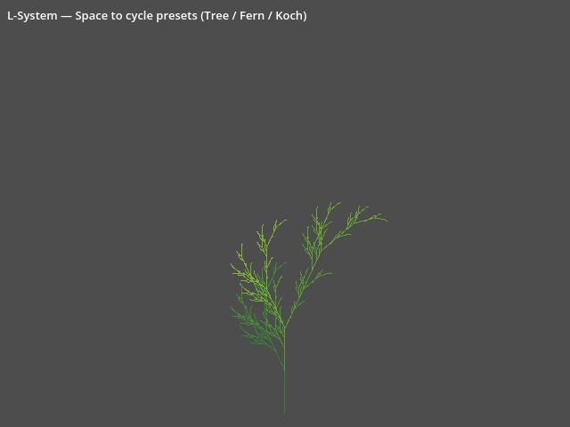](../l-system) **[l-system](../l-system)** Lindenmayer string-rewriting generating fractal geometry via turtle graphics. | [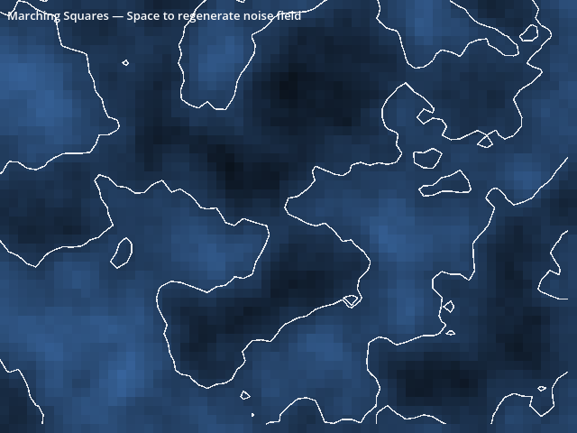](../marching-squares) **[marching-squares](../marching-squares)** Contour line extraction from a 2D scalar field. |
| [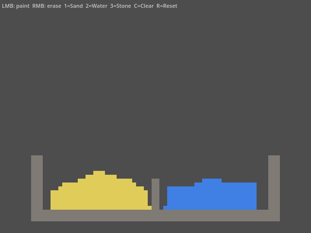](../cellular-automata) **[cellular-automata](../cellular-automata)** A falling-sand sim: sand, water, and stone with per-cell rules. |  |  |

## 🖼️ Rendering & Scene Management

| | | |
|---|---|---|
| [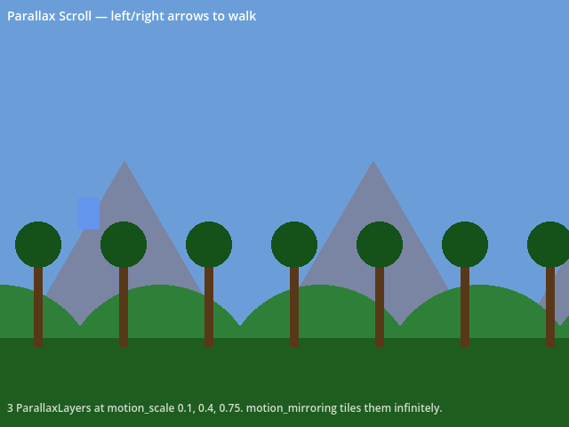](../parallax-scroll) **[parallax-scroll](../parallax-scroll)** Multiple background layers scrolling at different speeds for depth. | [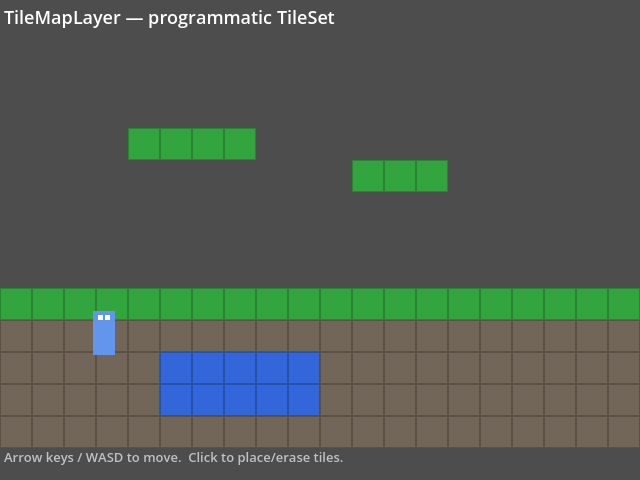](../tilemap) **[tilemap](../tilemap)** Build a `TileSet` and `TileMapLayer` in code with a runtime-generated atlas. | [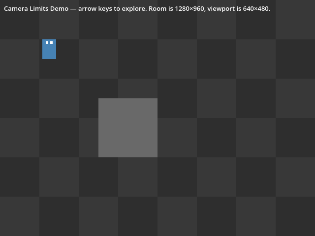](../tilemap-room) **[tilemap-room](../tilemap-room)** A scrollable room larger than the viewport with `Camera2D` limits. |
| [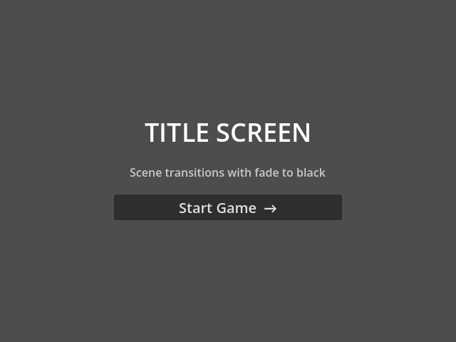](../scene-transition) **[scene-transition](../scene-transition)** Fade-to-black scene changes via a persistent Autoload `CanvasLayer`. | [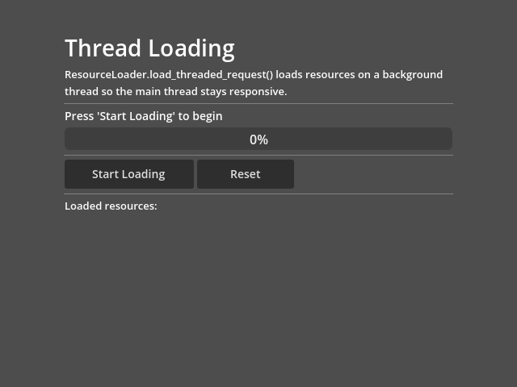](../thread-loading) **[thread-loading](../thread-loading)** `load_threaded_request()` background loading with a progress UI. | [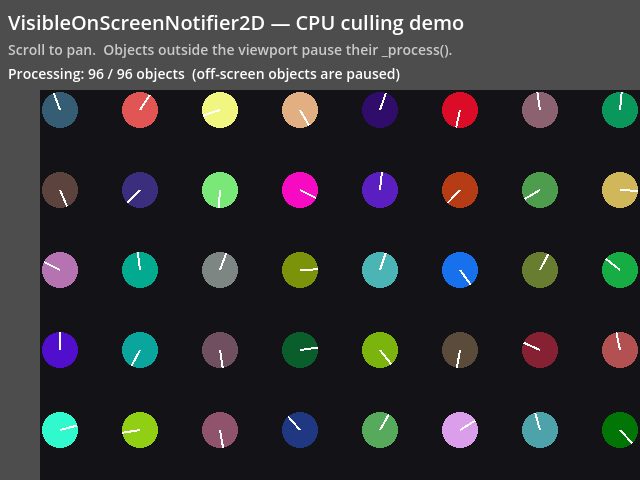](../visible-notifier) **[visible-notifier](../visible-notifier)** `VisibleOnScreenNotifier2D` signals for zero-poll CPU culling. |
| [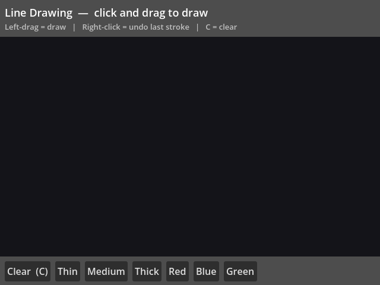](../line-drawing) **[line-drawing](../line-drawing)** Freehand stroke drawing via immediate-mode `_draw()`. | [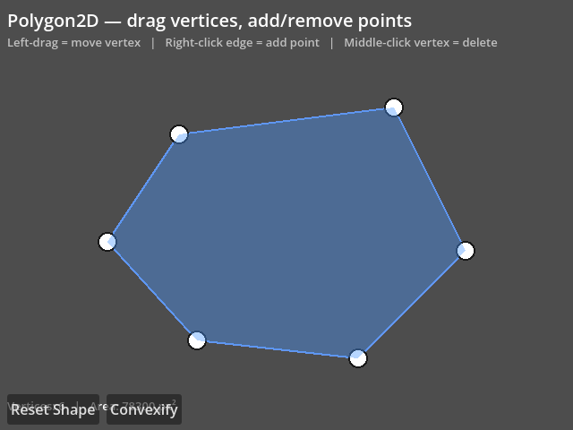](../polygon-clip) **[polygon-clip](../polygon-clip)** An interactive `Polygon2D` vertex editor with convex hull via `Geometry2D`. |  |

## 🧰 Editor Tooling

| | | |
|---|---|---|
| [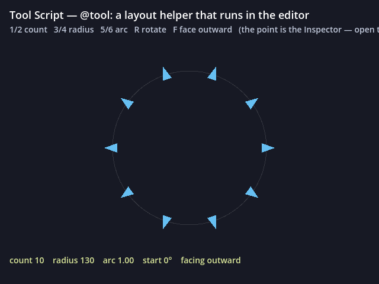](../tool-script) **[tool-script](../tool-script)** `@tool`: a layout helper that arranges its children in the editor, before the game runs. | [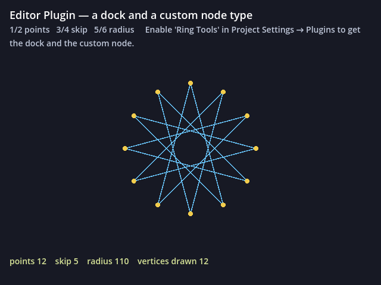](../editor-plugin) **[editor-plugin](../editor-plugin)** An `EditorPlugin` adding a dock and a custom node type, with symmetric teardown. |  |

## 🌐 Networking & Misc

| | | |
|---|---|---|
| [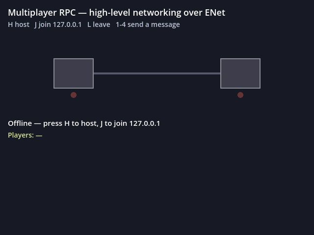](../multiplayer-rpc) **[multiplayer-rpc](../multiplayer-rpc)** High-level multiplayer over ENet: host/join, a server-authoritative roster, and `@rpc`. | [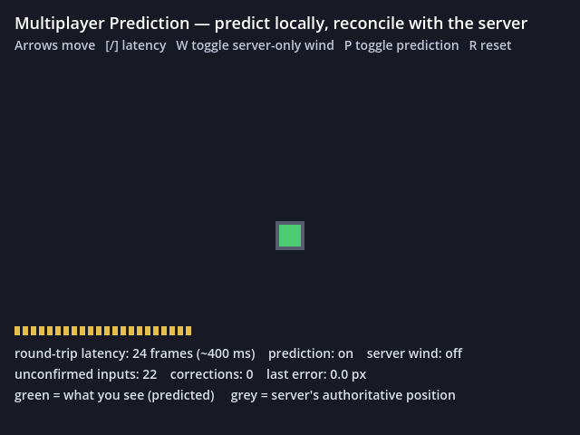](../multiplayer-prediction) **[multiplayer-prediction](../multiplayer-prediction)** Applying input locally, then reconciling when the authoritative server disagrees. | [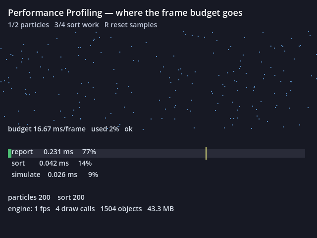](../performance-profiling) **[performance-profiling](../performance-profiling)** Measuring where a frame's time goes, against the budget the target rate gives you. |
| [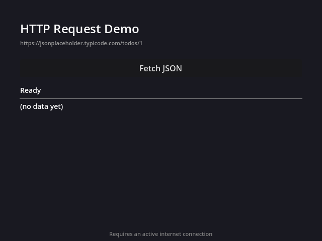](../http-request) **[http-request](../http-request)** Fetch and parse JSON from a public API with the `HTTPRequest` node. | [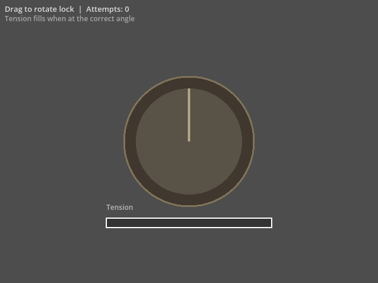](../lock-picking) **[lock-picking](../lock-picking)** Rotate a lock cylinder to find a hidden angle; tension builds when close. | [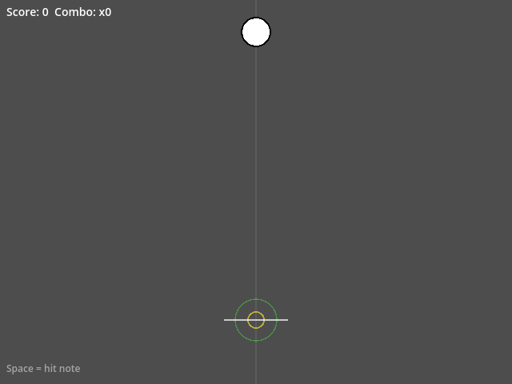](../rhythm-minigame) **[rhythm-minigame](../rhythm-minigame)** Timed-input rhythm mechanics with a scoring judgment window. |

---

_165 demos, 165 with screenshots, 0 animated._
